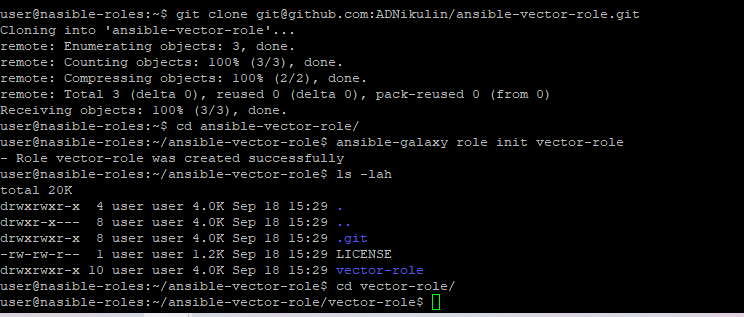
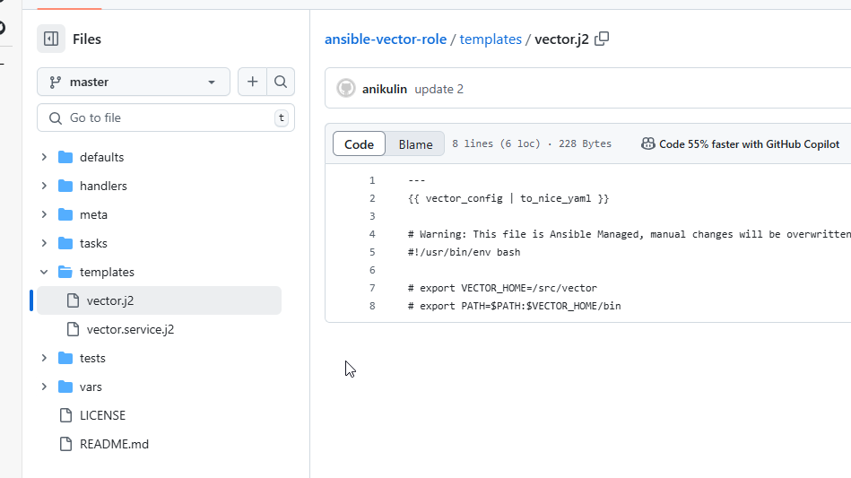
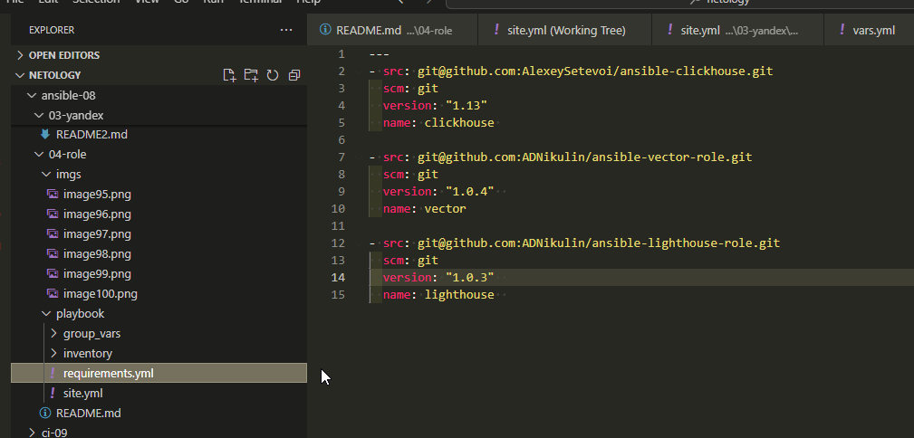

# Система управления конфигурациями. Никулин Александр. 
# Домашнее задание к занятию 4 «Работа с roles»

## Подготовка к выполнению
<details>
  <summary>Детали</summary>

  1. * Необязательно. Познакомьтесь с [LightHouse](https://youtu.be/ymlrNlaHzIY?t=929).
  2. Создайте два пустых публичных репозитория в любом своём проекте: vector-role и lighthouse-role.
  3. Добавьте публичную часть своего ключа к своему профилю на GitHub.

</details>

## Основная часть
<details>
  <summary>Детали</summary>

  Ваша цель — разбить ваш playbook на отдельные roles. 

  Задача — сделать roles для ClickHouse, Vector и LightHouse и написать playbook для использования этих ролей. 

  Ожидаемый результат — существуют три ваших репозитория: два с roles и один с playbook.

  **Что нужно сделать**

  1. Создайте в старой версии playbook файл `requirements.yml` и заполните его содержимым:

    ```yaml
    ---
      - src: git@github.com:AlexeySetevoi/ansible-clickhouse.git
        scm: git
        version: "1.13"
        name: clickhouse 
    ```
     - [Подготовил](ansible-08/04-role/playbook/requirements.yml).
  2. При помощи `ansible-galaxy` скачайте себе эту роль.
     - `ansible-galaxy install -r requirements.yml -p roles`
  3. Создайте новый каталог с ролью при помощи `ansible-galaxy role init vector-role`.
     - Подготовил [репозиторий](https://github.com/ADNikulin/ansible-vector-role).
     - 
  4. На основе tasks из старого playbook заполните новую role. Разнесите переменные между `vars` и `default`. 
     - Обновил репу - https://github.com/ADNikulin/ansible-vector-role/
  5. Перенести нужные шаблоны конфигов в `templates`.
     - 
  6. Опишите в `README.md` обе роли и их параметры. Пример качественной документации ansible role [по ссылке](https://github.com/cloudalchemy/ansible-prometheus).
     - https://github.com/ADNikulin/ansible-vector-role
  7. Повторите шаги 3–6 для LightHouse. Помните, что одна роль должна настраивать один продукт.
     - https://github.com/ADNikulin/ansible-lighthouse-role
  8. Выложите все roles в репозитории. Проставьте теги, используя семантическую нумерацию. Добавьте roles в `requirements.yml` в playbook.
     - https://github.com/ADNikulin/ansible-vector-role/releases/tag/1.0.0
     - https://github.com/ADNikulin/ansible-lighthouse-role/releases/tag/1.0.0
     - 
  9. Переработайте playbook на использование roles. Не забудьте про зависимости LightHouse и возможности совмещения `roles` с `tasks`.
     - 
  10. Выложите playbook в репозиторий.
  11. В ответе дайте ссылки на оба репозитория с roles и одну ссылку на репозиторий с playbook.
  
</details>
---
