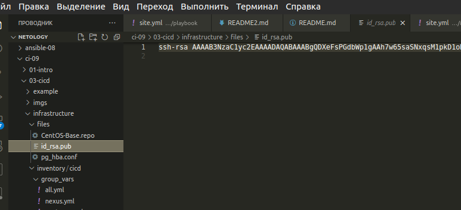
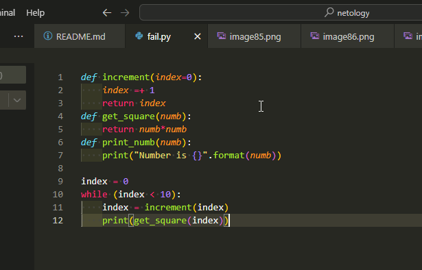

# Непрерывная разработка и интеграция. Никулин Александр. 
# Домашнее задание к занятию 9 «Процессы CI/CD»

## Подготовка к выполнению

  
Детали

  1. Создайте два VM в Yandex Cloud с параметрами: 2CPU 4RAM Centos7 (остальное по минимальным требованиям).
      - 
  2. Пропишите в [inventory](./infrastructure/inventory/cicd/hosts.yml) [playbook](./infrastructure/site.yml) созданные хосты.
      - 
  3. Добавьте в [files](./infrastructure/files/) файл со своим публичным ключом (id_rsa.pub). Если ключ называется иначе — найдите таску в плейбуке, которая использует id_rsa.pub имя, и исправьте на своё.
      - 
  4. Запустите playbook, ожидайте успешного завершения.
      - пришлось править так же реcentosBase repo на vault и накатывать 12й постгрю
      - 
  5. Проверьте готовность SonarQube через [браузер](http://localhost:9000).
      - 
  6. Зайдите под admin\admin, поменяйте пароль на свой.
      - 
  7.  Проверьте готовность Nexus через [бразуер](http://localhost:8081).
      - 
  8. Подключитесь под admin\admin123, поменяйте пароль, сохраните анонимный доступ.
      - 

## Знакомоство с SonarQube

### Основная часть

  
Детали

  1. Создайте новый проект, название произвольное.
      - 
  2. Скачайте пакет sonar-scanner, который вам предлагает скачать SonarQube.
      - 
      - 
  3. Сделайте так, чтобы binary был доступен через вызов в shell (или поменяйте переменную PATH, или любой другой, удобный вам способ).
      - 
  4. Проверьте `sonar-scanner --version`.
      - 
  5. Запустите анализатор против кода из директории [example](./example) с дополнительным ключом `-Dsonar.coverage.exclusions=fail.py`.
      - 
      - 
  6. Посмотрите результат в интерфейсе.
      - 
  7. Исправьте ошибки, которые он выявил, включая warnings.
      - 
  8. Запустите анализатор повторно — проверьте, что QG пройдены успешно.
      - 
  9. Сделайте скриншот успешного прохождения анализа, приложите к решению ДЗ.
      - 

## Знакомство с Nexus

### Основная часть

  
Детали

  1. В репозиторий `maven-public` загрузите артефакт с GAV-параметрами:

  *    groupId: netology;
  *    artifactId: java;
  *    version: 8_282;
  *    classifier: distrib;
  *    type: tar.gz.
    
  2. В него же загрузите такой же артефакт, но с version: 8_102.
  3. Проверьте, что все файлы загрузились успешно.
  4. В ответе пришлите файл `maven-metadata.xml` для этого артефекта.

### Знакомство с Maven

### Подготовка к выполнению

  
Детали

  1. Скачайте дистрибутив с [maven](https://maven.apache.org/download.cgi).
  2. Разархивируйте, сделайте так, чтобы binary был доступен через вызов в shell (или поменяйте переменную PATH, или любой другой, удобный вам способ).
  3. Удалите из `apache-maven-<version>/conf/settings.xml` упоминание о правиле, отвергающем HTTP- соединение — раздел mirrors —> id: my-repository-http-unblocker.
  4. Проверьте `mvn --version`.
  5. Заберите директорию [mvn](./mvn) с pom.

  ### Основная часть

  1. Поменяйте в `pom.xml` блок с зависимостями под ваш артефакт из первого пункта задания для Nexus (java с версией 8_282).
  2. Запустите команду `mvn package` в директории с `pom.xml`, ожидайте успешного окончания.
  3. Проверьте директорию `~/.m2/repository/`, найдите ваш артефакт.
  4. В ответе пришлите исправленный файл `pom.xml`.

---

### Как оформить решение задания

Выполненное домашнее задание пришлите в виде ссылки на .md-файл в вашем репозитории.

---
