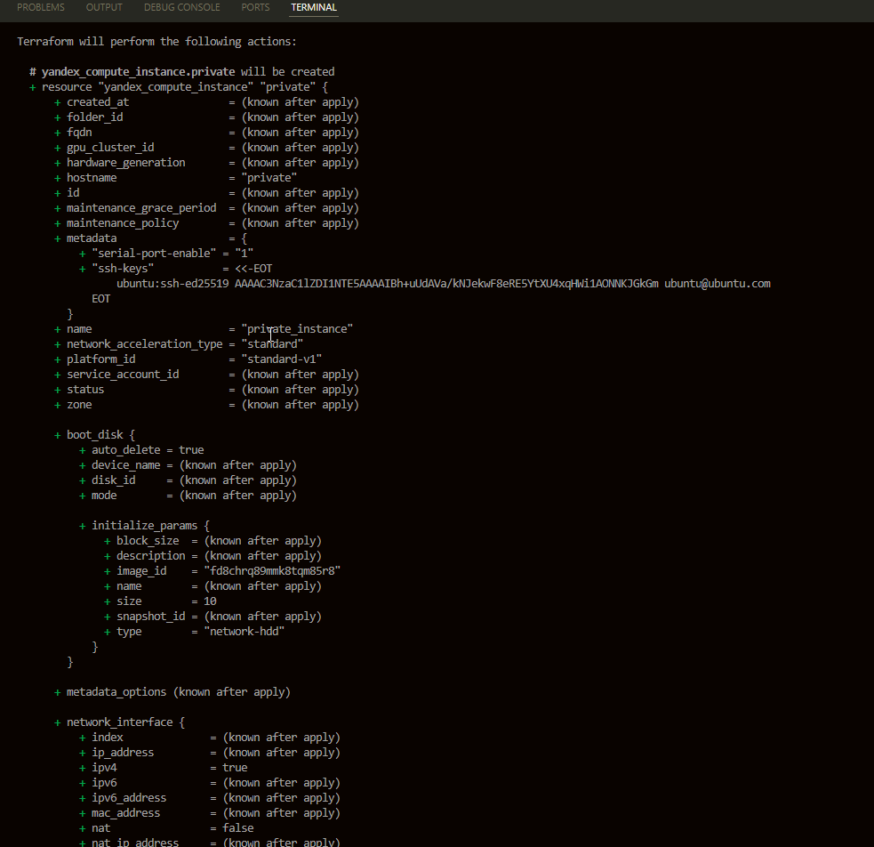
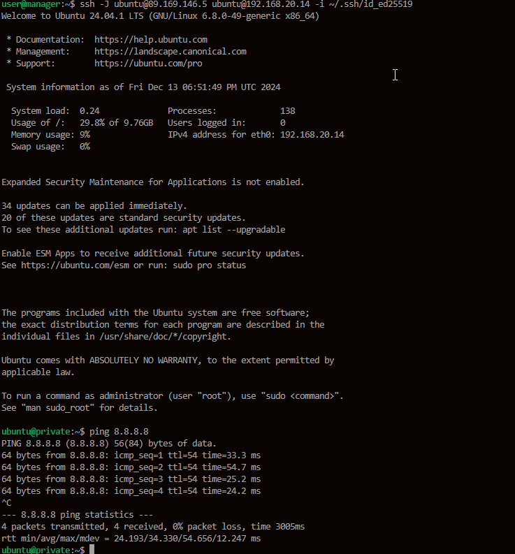

# Домашнее задание к занятию «Организация сети»

### Подготовка к выполнению задания

1. Домашнее задание состоит из обязательной части, которую нужно выполнить на провайдере Yandex Cloud, и дополнительной части в AWS (выполняется по желанию). 
2. Все домашние задания в блоке 15 связаны друг с другом и в конце представляют пример законченной инфраструктуры.  
3. Все задания нужно выполнить с помощью Terraform. Результатом выполненного домашнего задания будет код в репозитории. 
4. Перед началом работы настройте доступ к облачным ресурсам из Terraform, используя материалы прошлых лекций и домашнее задание по теме «Облачные провайдеры и синтаксис Terraform». Заранее выберите регион (в случае AWS) и зону.

---
### Задание 1. Yandex Cloud 

**Что нужно сделать**

  
Детали

  1. Создать пустую VPC. Выбрать зону.
  2. Публичная подсеть.

  - Создать в VPC subnet с названием public, сетью 192.168.10.0/24.
  - Создать в этой подсети NAT-инстанс, присвоив ему адрес 192.168.10.254. В качестве image_id использовать fd80mrhj8fl2oe87o4e1.
  - Создать в этой публичной подсети виртуалку с публичным IP, подключиться к ней и убедиться, что есть доступ к интернету.
  3. Приватная подсеть.
  - Создать в VPC subnet с названием private, сетью 192.168.20.0/24.
  - Создать route table. Добавить статический маршрут, направляющий весь исходящий трафик private сети в NAT-инстанс.
  - Создать в этой приватной подсети виртуалку с внутренним IP, подключиться к ней через виртуалку, созданную ранее, и убедиться, что есть доступ к интернету.

  Resource Terraform для Yandex Cloud:

  - [VPC subnet](https://registry.terraform.io/providers/yandex-cloud/yandex/latest/docs/resources/vpc_subnet).
  - [Route table](https://registry.terraform.io/providers/yandex-cloud/yandex/latest/docs/resources/vpc_route_table).
  - [Compute Instance](https://registry.terraform.io/providers/yandex-cloud/yandex/latest/docs/resources/compute_instance).

  > Подготовлены все файлы для создания инфры по заданию \
  > [полный пак файлов](src/terraform): 
  > - [data.tf](src/terraform/data.tf) - здесь все ресурсы и образы для машин
  > - [vpc-networks.tf](src/terraform/vpc-networks.tf) - Здесь сеть + подсеть
  > - [instance-nat.tf](src/terraform/instance-nat.tf) - Машина с натом, образ берется не из задания, и семейства **nat-instance-ubuntu**
  > - [instance-public.tf](src/terraform/instance-public.tf) - Машина для публичного доступа
  > - [instance-private.tf](src/terraform/instance-private.tf) - Машина для приватной сети
  > - [variables.tf](src/terraform/variables.tf) - Базовые переменные \
  > - [providers.tf](src/terraform/providers.tf) - Базовая настройка доступа к провайдеру и vpc
  > - [route_table-private.tf](src/terraform/route_table-private.tf) - таблица маршрутизации
  > Собтственно запуск + план + apply, приводить не буду, разве что частичный план \
  >  \
  > Результат применения терраформа \
  >  \
  > Теперь пинги с ната и паблика \
  >  \
  >  \
  > Пинги с таблицой маршрутизации \
  >  \
  > Пинги с приватной машины без таблицы маршрутизации \
  >  \
  > Готово.

---
### Задание 2. AWS* (задание со звёздочкой)

Это необязательное задание. Его выполнение не влияет на получение зачёта по домашней работе.

**Что нужно сделать**

  
Детали

  1. Создать пустую VPC с подсетью 10.10.0.0/16.
  2. Публичная подсеть.

  - Создать в VPC subnet с названием public, сетью 10.10.1.0/24.
  - Разрешить в этой subnet присвоение public IP по-умолчанию.
  - Создать Internet gateway.
  - Добавить в таблицу маршрутизации маршрут, направляющий весь исходящий трафик в Internet gateway.
  - Создать security group с разрешающими правилами на SSH и ICMP. Привязать эту security group на все, создаваемые в этом ДЗ, виртуалки.
  - Создать в этой подсети виртуалку и убедиться, что инстанс имеет публичный IP. Подключиться к ней, убедиться, что есть доступ к интернету.
  - Добавить NAT gateway в public subnet.
  3. Приватная подсеть.
  - Создать в VPC subnet с названием private, сетью 10.10.2.0/24.
  - Создать отдельную таблицу маршрутизации и привязать её к private подсети.
  - Добавить Route, направляющий весь исходящий трафик private сети в NAT.
  - Создать виртуалку в приватной сети.
  - Подключиться к ней по SSH по приватному IP через виртуалку, созданную ранее в публичной подсети, и убедиться, что с виртуалки есть выход в интернет.

  Resource Terraform:

  1. [VPC](https://registry.terraform.io/providers/hashicorp/aws/latest/docs/resources/vpc).
  1. [Subnet](https://registry.terraform.io/providers/hashicorp/aws/latest/docs/resources/subnet).
  1. [Internet Gateway](https://registry.terraform.io/providers/hashicorp/aws/latest/docs/resources/internet_gateway).

