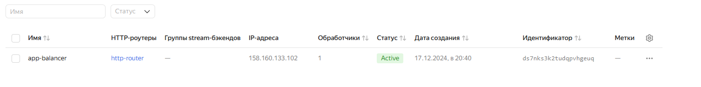

# Организация проекта при помощи облачных провайдеров. Никулин Александр. 
# Домашнее задание к занятию «Вычислительные мощности. Балансировщики нагрузки»  

### Подготовка к выполнению задания

1. Домашнее задание состоит из обязательной части, которую нужно выполнить на провайдере Yandex Cloud, и дополнительной части в AWS (выполняется по желанию). 
2. Все домашние задания в блоке 15 связаны друг с другом и в конце представляют пример законченной инфраструктуры.  
3. Все задания нужно выполнить с помощью Terraform. Результатом выполненного домашнего задания будет код в репозитории. 
4. Перед началом работы настройте доступ к облачным ресурсам из Terraform, используя материалы прошлых лекций и домашних заданий.

---

## Задание 1. Yandex Cloud 
<details>
  <summary>Детали</summary>

  **Что нужно сделать**

  1. Создать бакет Object Storage и разместить в нём файл с картинкой:

  - Создать бакет в Object Storage с произвольным именем (например, _имя_студента_дата_).
  - Положить в бакет файл с картинкой.
  - Сделать файл доступным из интернета.

  > Полный код доступен тут, по файлам для [terraform](src) \
  > Начал с самого простого:
  > - 
  > - [storage_object](src/storage_object.tf) - Загружаемый объект, там же и будет картинка
  > - [bucket](src/bucket.tf) - сама настрйока бакета. Тут же создаем все необходимые переменные сервис аккаунты для доступа, ключи и т.п.
  > - [providers](src/providers.tf) - используемый провайдер (yandex)
  > - [сети](src/vpc-networks.tf) - создаем тут сам vpc, далее subnet 
  > Далее инициируем терраформ и запускаем его.
  > - 
  > - 
  > Результаты:
  > - 
  > - 
  > - 
  > - 
  > картинка доступна и скачивается
  
  2. Создать группу ВМ в public подсети фиксированного размера с шаблоном LAMP и веб-страницей, содержащей ссылку на картинку из бакета:

  - Создать Instance Group с тремя ВМ и шаблоном LAMP. Для LAMP рекомендуется использовать `image_id = fd827b91d99psvq5fjit`.
  - Для создания стартовой веб-страницы рекомендуется использовать раздел `user_data` в [meta_data](https://cloud.yandex.ru/docs/compute/concepts/vm-metadata).
  - Разместить в стартовой веб-странице шаблонной ВМ ссылку на картинку из бакета.
  - Настроить проверку состояния ВМ.

  > Далее создаем  [сеть](src/vpc-networks.tf) и группу машин и всё остальное по заданию
  > - [instance-group](src/instance-group.tf) - настройки групповых машин
  > - [сеть](src/vpc-networks.tf) - настройки сети
  > - [data](src/data.tf) - набор базовых перменных и образов + ссылок на ключики для доступа по ssh
  > -  - тут настраиваем базовый index шаблон, с ссылкой на бакет
  > -  - Настрйока проверки состояния машин
  > В общем запускаем терраформ и смотрим:
  > -  
  > - 
  > - 
  > Видим три машины, зайдем и глянем что у них в index:
  > - 
  > Видим нашу картинку

  3. Подключить группу к сетевому балансировщику:

  - Создать сетевой балансировщик.
  - Проверить работоспособность, удалив одну или несколько ВМ.

  > - [network_load_balancer](src/lb_network_load_balancer.tf)
  > Балансировщик нагрузки будет регулярно проверять доступность порта 80 и пути "/" при обращении к группе виртуальных машин. Проверка будет проводиться каждые 2 секунды, и если ответ не будет получен в течение 1 секунды, балансировщик считает сервер недоступным. Для перевода сервера в недоступное состояние потребуется две неудачные проверки, а для возвращения в доступное — пять успешных. \
  > Запускаем террафом, смотрим поднялся ли он, получаем ip и заходим по нему: 
  > - 
  > - 
  > Теперь застопорим машины и првоерим его работу:
  > - 
  > - 
  > Доступ по прежнему имеется, кстати можно дополнительно глянуть на то, как машина сама поднялась: 
  > - 

  4. (дополнительно)* Создать Application Load Balancer с использованием Instance group и проверкой состояния.

  > Теперь список кода, для поднятия app balancer: 
  > - [alb_target_group](src/alb_target_group.tf) - таргет группы
  > - [alb_http_router](src/alb_http_router.tf) - роутер
  > - [alb_backend_group](src/alb_backend_group.tf) - ГРуппа бекендов
  > - [alb_load_balancer](src/alb_load_balancer.tf) - Сам балансировщик
  > Запускаем терраформ и смотрим результат: 
  > - 
  > Весь спсиок сервисов, который был поднят
  > - 
  > - 
  > - 
  > - 
  > Проверим базовую работоспособность роутера, пройдя по его ip и потом так же отключим машины и првоерим доступ
  > - 
  > - 
  > - 
  > Всё потом опять поднялось и работало

  Полезные документы:

  - [Compute instance group](https://registry.terraform.io/providers/yandex-cloud/yandex/latest/docs/resources/compute_instance_group).
  - [Network Load Balancer](https://registry.terraform.io/providers/yandex-cloud/yandex/latest/docs/resources/lb_network_load_balancer).
  - [Группа ВМ с сетевым балансировщиком](https://cloud.yandex.ru/docs/compute/operations/instance-groups/create-with-balancer).
</details>

---

## Задание 2*. AWS (задание со звёздочкой)

<details>
  <summary>Детали</summary>

  Это необязательное задание. Его выполнение не влияет на получение зачёта по домашней работе.

  **Что нужно сделать**

  Используя конфигурации, выполненные в домашнем задании из предыдущего занятия, добавить к Production like сети Autoscaling group из трёх EC2-инстансов с  автоматической установкой веб-сервера в private домен.

  1. Создать бакет S3 и разместить в нём файл с картинкой:

  - Создать бакет в S3 с произвольным именем (например, _имя_студента_дата_).
  - Положить в бакет файл с картинкой.
  - Сделать доступным из интернета.
  2. Сделать Launch configurations с использованием bootstrap-скрипта с созданием веб-страницы, на которой будет ссылка на картинку в S3. 
  3. Загрузить три ЕС2-инстанса и настроить LB с помощью Autoscaling Group.

  Resource Terraform:

  - [S3 bucket](https://registry.terraform.io/providers/hashicorp/aws/latest/docs/resources/s3_bucket)
  - [Launch Template](https://registry.terraform.io/providers/hashicorp/aws/latest/docs/resources/launch_template).
  - [Autoscaling group](https://registry.terraform.io/providers/hashicorp/aws/latest/docs/resources/autoscaling_group).
  - [Launch configuration](https://registry.terraform.io/providers/hashicorp/aws/latest/docs/resources/launch_configuration).

  Пример bootstrap-скрипта:

  ```
  #!/bin/bash
  yum install httpd -y
  service httpd start
  chkconfig httpd on
  cd /var/www/html
  echo "<html><h1>My cool web-server</h1></html>" > index.html
  ```

</details>