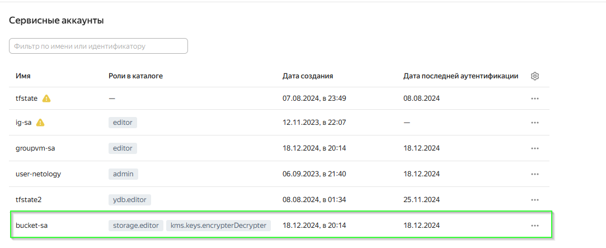

# Домашнее задание к занятию «Безопасность в облачных провайдерах»  

Используя конфигурации, выполненные в рамках предыдущих домашних заданий, нужно добавить возможность шифрования бакета.

---

## Задание 1. Yandex Cloud   
<details>
  <summary>Детали</summary>

  1. С помощью ключа в KMS необходимо зашифровать содержимое бакета:

  - создать ключ в KMS;
  - с помощью ключа зашифровать содержимое бакета, созданного ранее.

  > Решил не особо париться и использовать предыдущий урок, там как раз есть бакет и пользователи нужные. \
  > Весь список файлов: [terraform](src) \
  >  \
  > Создаю роль для службы KMS, которая даст возможность зашифровывать и расшифровывать данные: 
  > -  \
  > Создаю симметричный ключ шифрования с алгоритмом шифрования AES_128 и временем жизни 24 часа: \
  > -  \
  > Применяю ключ шифрования к созданному ранее бакету: 
  > -  \
  > Запускаем терраформ и проверяем результаты: 
  > -  
  > -  \
  > Ключ шифрования создан. Получаем ссылку на бакет и пытаемся открыть его: 
  > -  \
  > Доступа к файлу в бакете нет, т.к. он зашифрован.

  2. (Выполняется не в Terraform)* Создать статический сайт в Object Storage c собственным публичным адресом и сделать доступным по HTTPS:

  - создать сертификат;
  - создать статическую страницу в Object Storage и применить сертификат HTTPS;
  - в качестве результата предоставить скриншот на страницу с сертификатом в заголовке (замочек).

  > Своего домена нет, поэтому решил не делать

  Полезные документы:

  - [Настройка HTTPS статичного сайта](https://cloud.yandex.ru/docs/storage/operations/hosting/certificate).
  - [Object Storage bucket](https://registry.terraform.io/providers/yandex-cloud/yandex/latest/docs/resources/storage_bucket).
  - [KMS key](https://registry.terraform.io/providers/yandex-cloud/yandex/latest/docs/resources/kms_symmetric_key).
</details>

--- 
## Задание 2*. AWS (задание со звёздочкой)

<details>
  <summary>Детали</summary>

  Это необязательное задание. Его выполнение не влияет на получение зачёта по домашней работе.

  **Что нужно сделать**

  1. С помощью роли IAM записать файлы ЕС2 в S3-бакет:
  - создать роль в IAM для возможности записи в S3 бакет;
  - применить роль к ЕС2-инстансу;
  - с помощью bootstrap-скрипта записать в бакет файл веб-страницы.
  2. Организация шифрования содержимого S3-бакета:

  - используя конфигурации, выполненные в домашнем задании из предыдущего занятия, добавить к созданному ранее бакету S3 возможность шифрования Server-Side, используя общий ключ;
  - включить шифрование SSE-S3 бакету S3 для шифрования всех вновь добавляемых объектов в этот бакет.

  3. *Создание сертификата SSL и применение его к ALB:

  - создать сертификат с подтверждением по email;
  - сделать запись в Route53 на собственный поддомен, указав адрес LB;
  - применить к HTTPS-запросам на LB созданный ранее сертификат.

  Resource Terraform:

  - [IAM Role](https://registry.terraform.io/providers/hashicorp/aws/latest/docs/resources/iam_role).
  - [AWS KMS](https://registry.terraform.io/providers/hashicorp/aws/latest/docs/resources/kms_key).
  - [S3 encrypt with KMS key](https://registry.terraform.io/providers/hashicorp/aws/latest/docs/resources/s3_bucket_object#encrypting-with-kms-key).

  Пример bootstrap-скрипта:

  ```
  #!/bin/bash
  yum install httpd -y
  service httpd start
  chkconfig httpd on
  cd /var/www/html
  echo "<html><h1>My cool web-server</h1></html>" > index.html
  aws s3 mb s3://mysuperbacketname2021
  aws s3 cp index.html s3://mysuperbacketname2021
  ```
</details>