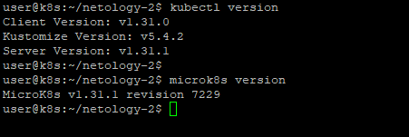
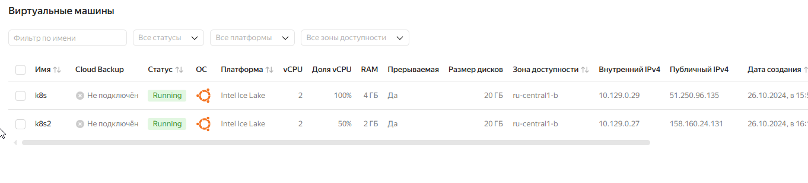
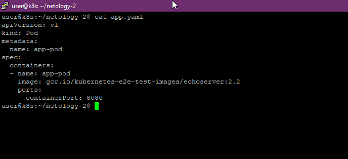
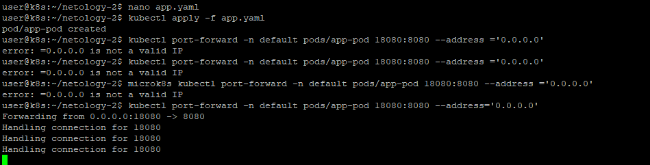
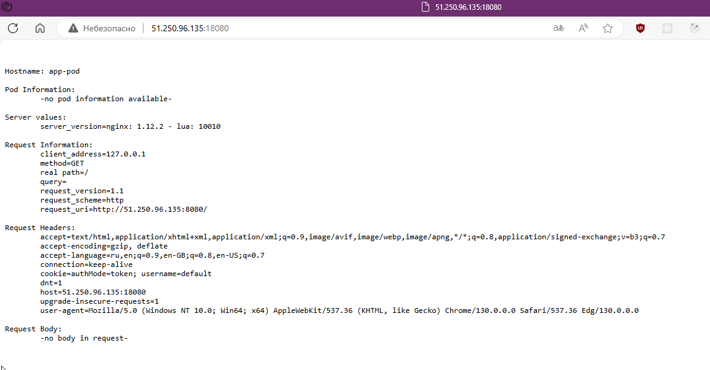
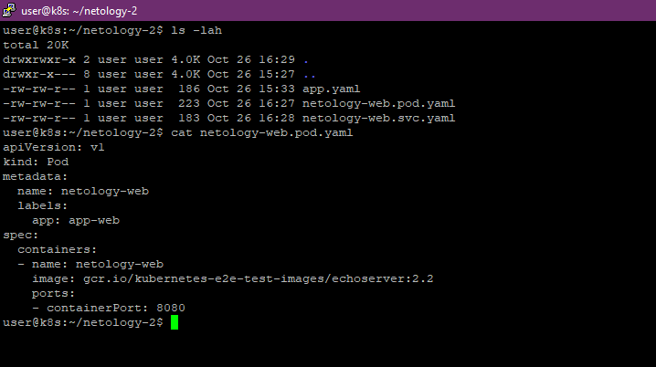
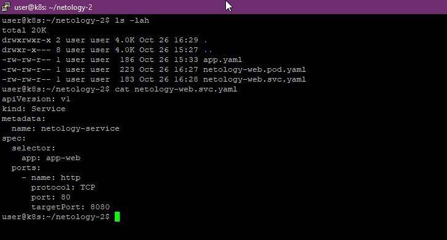
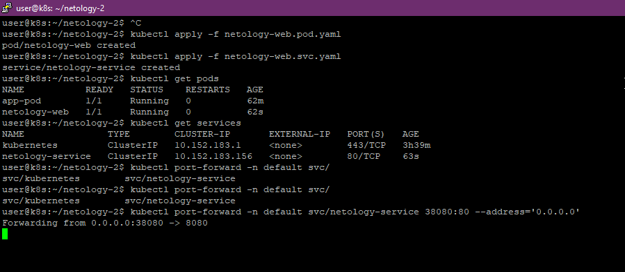
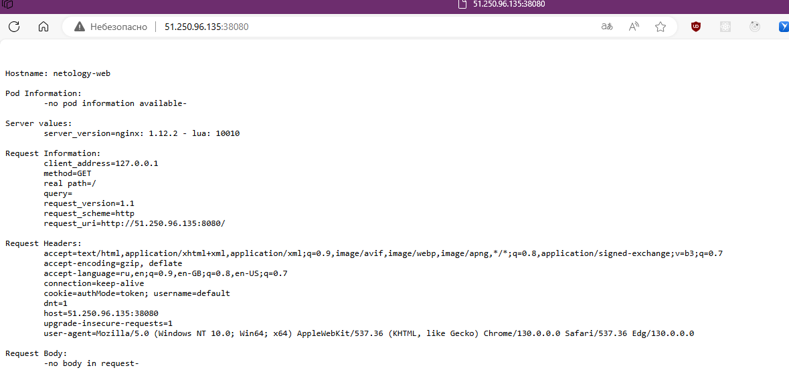

# Kubernetes. Никулин Александр. 
# Домашнее задание к занятию «Базовые объекты K8S»

### Цель задания

В тестовой среде для работы с Kubernetes, установленной в предыдущем ДЗ, необходимо развернуть Pod с приложением и подключиться к нему со своего локального компьютера. 

------

### Чеклист готовности к домашнему заданию

1. Установленное k8s-решение (например, MicroK8S).
2. Установленный локальный kubectl.
3. Редактор YAML-файлов с подключенным Git-репозиторием.

  
Результат

  >  \
  > 

------

### Инструменты и дополнительные материалы, которые пригодятся для выполнения задания

1. Описание [Pod](https://kubernetes.io/docs/concepts/workloads/pods/) и примеры манифестов.
2. Описание [Service](https://kubernetes.io/docs/concepts/services-networking/service/).

------

### Задание 1. Создать Pod с именем hello-world

  
Детали

  1. Создать манифест (yaml-конфигурацию) Pod.
      > 
  2. Использовать image - gcr.io/kubernetes-e2e-test-images/echoserver:2.2.
      > 
  3. Подключиться локально к Pod с помощью `kubectl port-forward` и вывести значение (curl или в браузере).
      >  \
      > 

------

### Задание 2. Создать Service и подключить его к Pod

  
Детали

  1. Создать Pod с именем netology-web.
      > 
  2. Использовать image — gcr.io/kubernetes-e2e-test-images/echoserver:2.2.
      > 
  3. Создать Service с именем netology-svc и подключить к netology-web.
      > 
  4. Подключиться локально к Service с помощью `kubectl port-forward` и вывести значение (curl или в браузере).
      >  \
      > 

------
