# Kubernetes. Никулин Александр. 
# Домашнее задание к занятию «Запуск приложений в K8S»

### Цель задания

В тестовой среде для работы с Kubernetes, установленной в предыдущем ДЗ, необходимо развернуть Deployment с приложением, состоящим из нескольких контейнеров, и масштабировать его.

------

### Чеклист готовности к домашнему заданию
<details>
  <summary>Детали</summary>

  1. Установленное k8s-решение (например, MicroK8S).
  2. Установленный локальный kubectl.
  3. Редактор YAML-файлов с подключённым git-репозиторием.
</details>

------

### Инструменты и дополнительные материалы, которые пригодятся для выполнения задания

1. [Описание](https://kubernetes.io/docs/concepts/workloads/controllers/deployment/) Deployment и примеры манифестов.
2. [Описание](https://kubernetes.io/docs/concepts/workloads/pods/init-containers/) Init-контейнеров.
3. [Описание](https://github.com/wbitt/Network-MultiTool) Multitool.

------

### Задание 1. Создать Deployment и обеспечить доступ к репликам приложения из другого Pod
<details>
  <summary>Раскрыть</summary>

  1. Создать Deployment приложения, состоящего из двух контейнеров — nginx и multitool. Решить возникшую ошибку.
      > Подготовил [deployment](nginx.deployment.yaml): 
      > ```
      > apiVersion: apps/v1
      > kind: Deployment
      > metadata:
      >   name: nginx-deployment
      >   labels:
      >     app: nginx
      > spec:
      >   replicas: 1
      >   selector:
      >     matchLabels:
      >       app: nginx
      >   template:
      >     metadata:
      >       labels:
      >         app: nginx
      >     spec:
      >       containers:
      >       - name: nginx
      >         image: nginx:latest
      >         ports:
      >         - containerPort: 80
      >       - name: multitool
      >         image: wbitt/network-multitool
      >         env:
      >         - name: HTTP_PORT
      >           value: "1180"
      >         - name: HTTPS_PORT
      >           value: "11443"
      >         ports:
      >         - containerPort: 1180
      >           name: http-port
      >         - containerPort: 11443
      >           name: https-port
      > ```
      > РАзвернул в кубере: 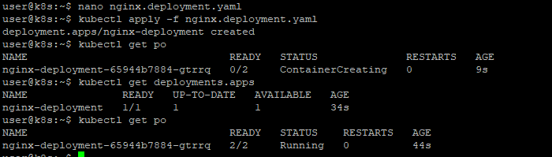\
      > 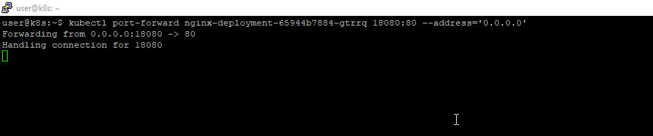\
      > 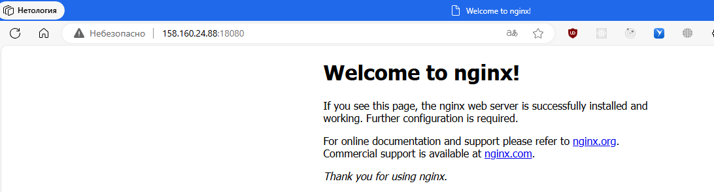
  2. После запуска увеличить количество реплик работающего приложения до 2.
      > 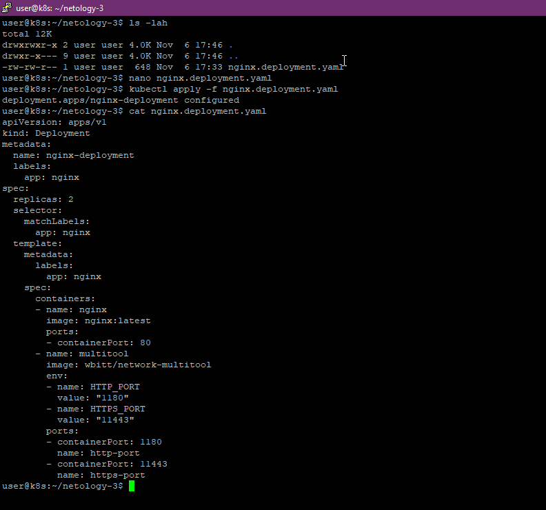
  3. Продемонстрировать количество подов до и после масштабирования.
      > Из старой картинкии, где запускал первый раз: \
      > \
      > после применения: \
      > 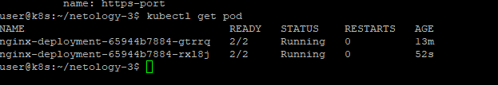
  4. Создать Service, который обеспечит доступ до реплик приложений из п.1.
      > Подготовил [service](nginx.svc.yaml)
      > ```
      > apiVersion: v1
      > kind: Service
      > metadata:
      >   name: nginx-svc
      > spec:
      >   selector:
      >     app: nginx
      >   ports:
      >     - name: http
      >       protocol: TCP
      >       port: 80
      >       targetPort: 80
      >       port: 1180
      >       targetPort: 1180
      >       port: 11443
      >       targetPort: 11443
      > ```
      > 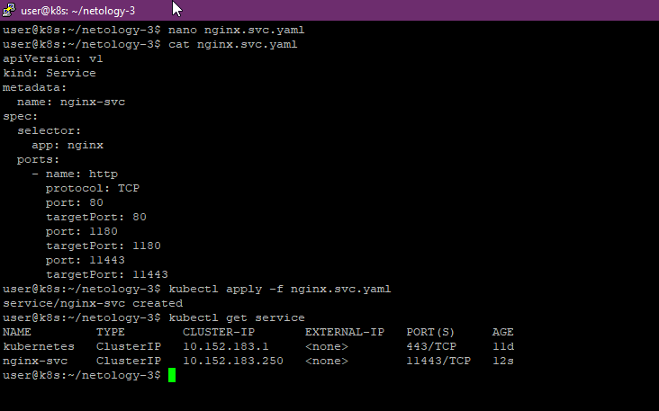
  5. Создать отдельный Pod с приложением multitool и убедиться с помощью `curl`, что из пода есть доступ до приложений из п.1.
      > [pod](multitool.pod.yaml) \
      > ```
      > apiVersion: v1
      > kind: Pod
      > metadata:
      >   name: multitool-tmp
      > spec:
      >   containers:
      >   - name: multitool-tmp
      >     image: wbitt/network-multitool
      >     env:
      >     - name: HTTP_PORT
      >       value: "1180"
      >     - name: HTTPS_PORT
      >       value: "11443"
      >     ports:
      >     - containerPort: 1180
      >       name: http-port
      >     - containerPort: 11443
      >       name: https-port
      > ```
      > 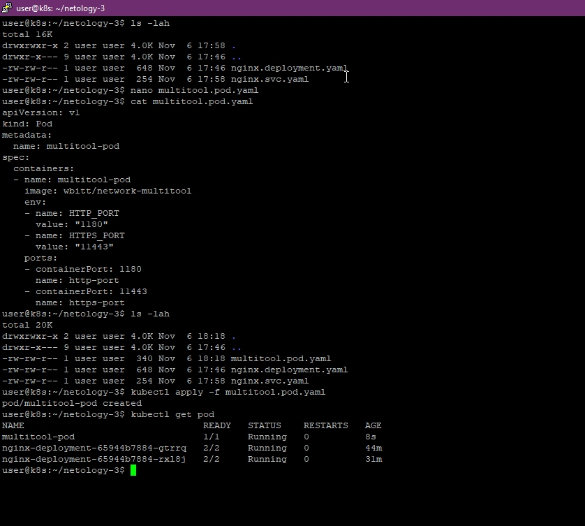 \
      > 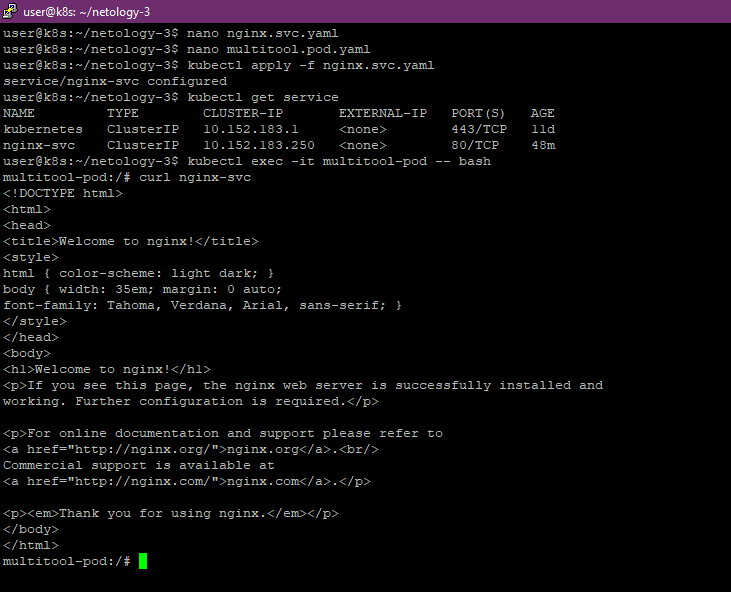

</details>
------

### Задание 2. Создать Deployment и обеспечить старт основного контейнера при выполнении условий
<details>
  <summary>Раскрыть</summary>

  1. Создать Deployment приложения nginx и обеспечить старт контейнера только после того, как будет запущен сервис этого приложения.
      > [deployment](nginx.2.deployment.yaml)
  2. Убедиться, что nginx не стартует. В качестве Init-контейнера взять busybox.
      > [deployment](nginx.2.deployment.yaml) \
      > Дублирую код:
      > ```
      > apiVersion: apps/v1
      > kind: Deployment
      > metadata:
      >   name: nginx-init-deploy
      >   namespace: netology
      > spec:
      >   selector:
      >     matchLabels:
      >       app: nginx-init
      >   replicas: 1
      >   template:
      >     metadata:
      >       labels:
      >         app: nginx-init
      >     spec:
      >       containers:
      >       - name: nginx
      >         image: nginx:latest
      >         ports:
      >         - containerPort: 80
      >       initContainers:
      >       - name: delay
      >         image: busybox
      >         command: ['sh', '-c', "until nslookup nginx-init-svc.$(cat /var/run/secrets/kubernetes.io/serviceaccount/namespace).svc.cluster.local; do echo waiting for nginx-init-svc; sleep 2; done"]
      > ```
      > Используем busybox и проверяем что нет в окружение нужного сервиса \
      > Результаты запуска \
      > 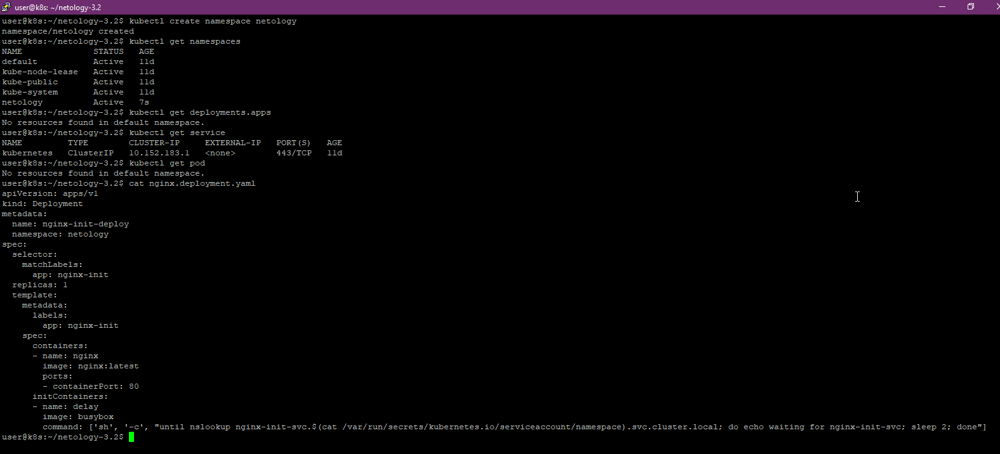 \
      > 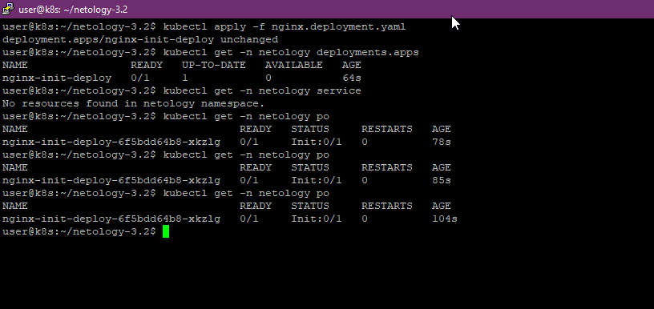
  3. Создать и запустить Service. Убедиться, что Init запустился.
      > [text](nginx.2.svc.yaml)
      > ```
      > apiVersion: v1
      > kind: Service
      > metadata:
      >   name: nginx-init-svc
      >   namespace: netology
      > spec:
      >   ports:
      >     - name: nginx-init
      >       port: 80
      >   selector:
      >     app: nginx-init
      > ```
      > 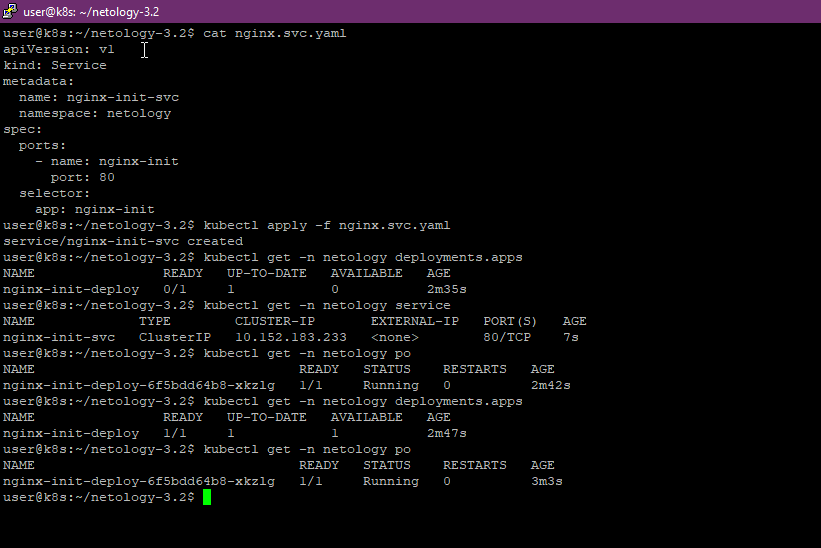
  4. Продемонстрировать состояние пода до и после запуска сервиса.
      > Собственно все фото выше
</details>
------
