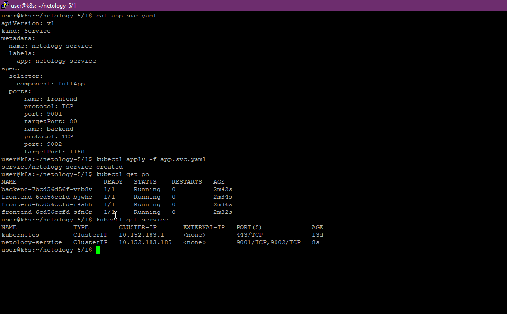
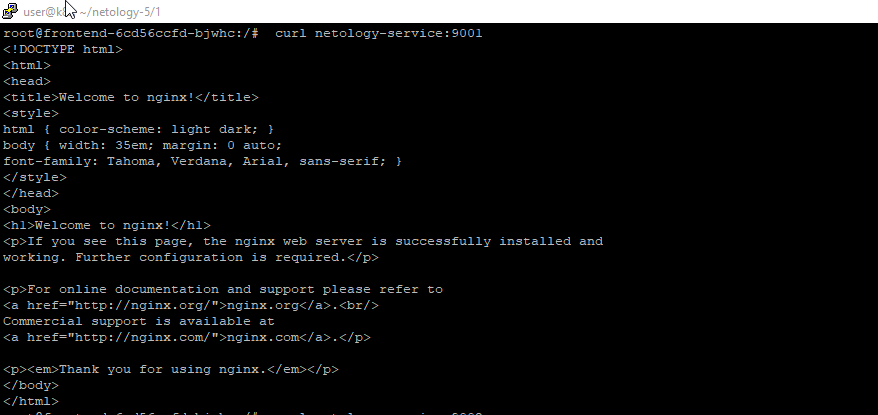

# Kubernetes. Никулин Александр. 
# Домашнее задание к занятию «Сетевое взаимодействие в K8S. Часть 2»

### Цель задания

В тестовой среде Kubernetes необходимо обеспечить доступ к двум приложениям снаружи кластера по разным путям.

------

### Чеклист готовности к домашнему заданию

  
Детали

  1. Установленное k8s-решение (например, MicroK8S).
  2. Установленный локальный kubectl.
  3. Редактор YAML-файлов с подключённым Git-репозиторием.

------

### Инструменты и дополнительные материалы, которые пригодятся для выполнения задания

  
Детали

  
  1. [Инструкция](https://microk8s.io/docs/getting-started) по установке MicroK8S.
  2. [Описание](https://kubernetes.io/docs/concepts/services-networking/service/) Service.
  3. [Описание](https://kubernetes.io/docs/concepts/services-networking/ingress/) Ingress.
  4. [Описание](https://github.com/wbitt/Network-MultiTool) Multitool.

------

### Задание 1. Создать Deployment приложений backend и frontend

  
Детали

  
  1. Создать Deployment приложения _frontend_ из образа nginx с количеством реплик 3 шт.
      > [Манифест](src/frontend.deployment.yaml) \
      > 
  2. Создать Deployment приложения _backend_ из образа multitool. 
      > [Манифест](src/backend.deployment.yaml) \
      > 
  3. Добавить Service, которые обеспечат доступ к обоим приложениям внутри кластера. 
      > [Манифест](src/app.svc.yaml) \
      > 
  4. Продемонстрировать, что приложения видят друг друга с помощью Service.
      > Пошел двумя путями. Развернул вспомогательный под.
      > [Манифест](src/multitool.pod.yaml) \
      >  \
      > Так же зашел в каждый из подов \
      >  \
      > 
  5. Предоставить манифесты Deployment и Service в решении, а также скриншоты или вывод команды п.4.
      > Ход решения представлен выше.

------

### Задание 2. Создать Ingress и обеспечить доступ к приложениям снаружи кластера

  
Детали

  
  1. Включить Ingress-controller в MicroK8S.
      > 
  2. Создать Ingress, обеспечивающий доступ снаружи по IP-адресу кластера MicroK8S так, чтобы при запросе только по адресу открывался _frontend_ а при добавлении /api - _backend_.
      > [ingress](src/apps.ingress.yaml) \
      > Запустил \
      >  \
  3. Продемонстрировать доступ с помощью браузера или `curl` с локального компьютера.
      > проверяем на самом сервере и в браузере \
      >  \
      >  \
      >  \
      > 
  4. Предоставить манифесты и скриншоты или вывод команды п.2.
      > Ход решения представлен выше.

------
