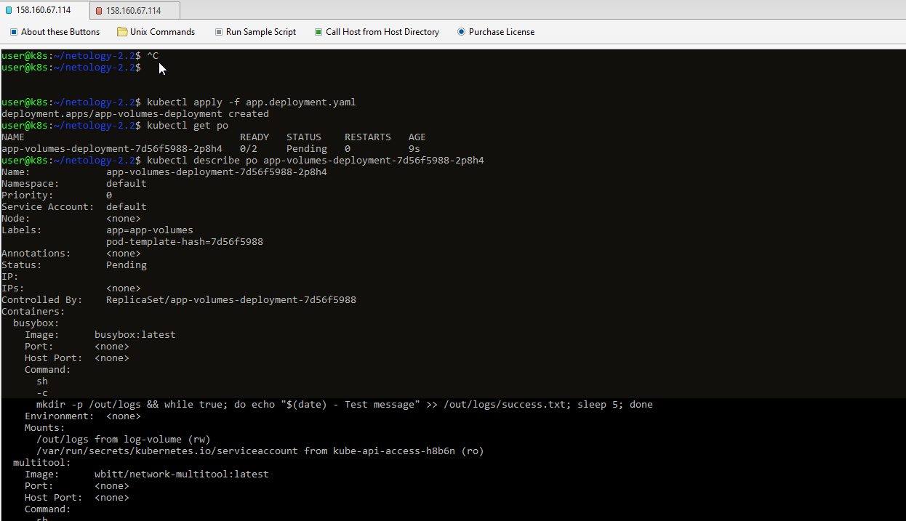

# Kubernetes. Никулин Александр.
# Домашнее задание к занятию «Хранение в K8s. Часть 2»

### Цель задания

В тестовой среде Kubernetes нужно создать PV и продемострировать запись и хранение файлов.

------

### Чеклист готовности к домашнему заданию

  
Детали

  1. Установленное K8s-решение (например, MicroK8S).
  2. Установленный локальный kubectl.
  3. Редактор YAML-файлов с подключенным GitHub-репозиторием.

------

### Дополнительные материалы для выполнения задания

  
Детали

  1. [Инструкция по установке NFS в MicroK8S](https://microk8s.io/docs/nfs). 
  2. [Описание Persistent Volumes](https://kubernetes.io/docs/concepts/storage/persistent-volumes/). 
  3. [Описание динамического провижининга](https://kubernetes.io/docs/concepts/storage/dynamic-provisioning/). 
  4. [Описание Multitool](https://github.com/wbitt/Network-MultiTool).

------

### Задание 1

  
Детали

  **Что нужно сделать**

  Создать Deployment приложения, использующего локальный PV, созданный вручную.

  1. Создать Deployment приложения, состоящего из контейнеров busybox и multitool.
      > [Манифест](src/app.deployment.yaml) \
      > Сразу поднимем под \
      >  \
      > pod не запстился, причина - нет раздела нужного \
      >  \
      > но поды готовы к развертке, так что поднимем теперь разделы
  2. Создать PV и PVC для подключения папки на локальной ноде, которая будет использована в поде.
      > [Манифест PV](src/volume.pv.yaml) \
      > [Манифест PVC](src/volume.pvc.yaml) \
      >  \
      > разделы поднялись, так же как и под
  3. Продемонстрировать, что multitool может читать файл, в который busybox пишет каждые пять секунд в общей директории. 
      >  \
      > 
  4. Удалить Deployment и PVC. Продемонстрировать, что после этого произошло с PV. Пояснить, почему.
      >  \
      >  \
      > PV в статусе Failed, т.к. контроллер PV не смог удалить данные в `/data/pvc-first`. По умолчанию он может удалить только данные в `/tmp`. Если бы там находились файлы, то они были бы утеряны.
  5. Продемонстрировать, что файл сохранился на локальном диске ноды. Удалить PV.  Продемонстрировать что произошло с файлом после удаления PV. Пояснить, почему.
      >  \
      > Файлы есть на локальной машине \
      >  \
      > Файлы всё так же находятся на месте. \
      > После удаления PV, файл в директории /data/pvc-first останется на месте из-за особенностей работы контроллера PV с hostPath. В случае если в манифесте PV политика persistentVolumeReclaimPolicy будет установлена в Recycle, то файл будет удален.
  6. Предоставить манифесты, а также скриншоты или вывод необходимых команд.
      > Ход выполнения задания выше.

------

### Задание 2

  
Детали

  **Что нужно сделать**

  Создать Deployment приложения, которое может хранить файлы на NFS с динамическим созданием PV.

  1. Включить и настроить NFS-сервер на MicroK8S.
      >  \
      > только пришлось подключить community ещё.
  2. Создать Deployment приложения состоящего из multitool, и подключить к нему PV, созданный автоматически на сервере NFS.
      > [Манифест Деплоймента](src/nfs.deployment.yaml) \
      > Сразу стартонем деплоймент \
      >  \
      > падаем с ошибкой. Если почитать описание, то видим причину, в отсутствие нужного вольюма. Исправим упущение...
      > [text](src/nfs.pvc.yaml) \
      >  \
      > Через некоторое время всё поднимается.
  3. Продемонстрировать возможность чтения и записи файла изнутри пода. 
      > \
      > \
      > Собственно зашел в поды, понаписал там всякое и потом уже на хост машине проверил файл 
  4. Предоставить манифесты, а также скриншоты или вывод необходимых команд.
      > Ход выполнения задания выше.

------
