# Kubernetes. Никулин Александр.
# Домашнее задание к занятию «Конфигурация приложений»

### Цель задания

В тестовой среде Kubernetes необходимо создать конфигурацию и продемонстрировать работу приложения.

------

### Чеклист готовности к домашнему заданию

  
Детали

	1. Установленное K8s-решение (например, MicroK8s).
	2. Установленный локальный kubectl.
	3. Редактор YAML-файлов с подключённым GitHub-репозиторием.

------

### Инструменты и дополнительные материалы, которые пригодятся для выполнения задания

  
Детали

  1. [Описание](https://kubernetes.io/docs/concepts/configuration/secret/) Secret.
  2. [Описание](https://kubernetes.io/docs/concepts/configuration/configmap/) ConfigMap.
  3. [Описание](https://github.com/wbitt/Network-MultiTool) Multitool.

------

### Задание 1. Создать Deployment приложения и решить возникшую проблему с помощью ConfigMap. Добавить веб-страницу

  
Детали

  1. Создать Deployment приложения, состоящего из контейнеров nginx и multitool.
      > [Манифест](src/nginx.deployment.yaml) \
      > 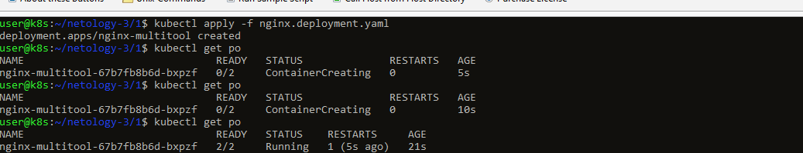 \
      > Собственно так и не понял какая там должна была быть проблема, ибо во всех предыдущих случаях мы разделяли порты. \
  2. Решить возникшую проблему с помощью ConfigMap.
      > ну предположил сразу, что надо вынести все порты в конфигмапы, что и сделал: \
      > [Манифест конфигмаппа](src/nginx.configmap.yaml) \
      > 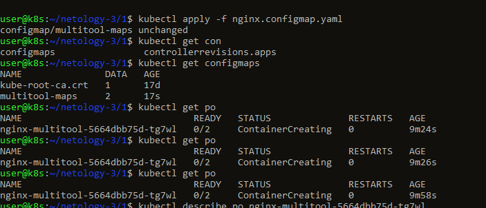 \
      > 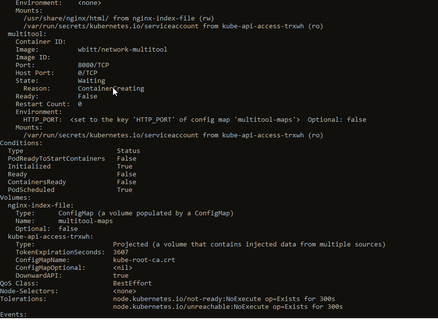 \
      > 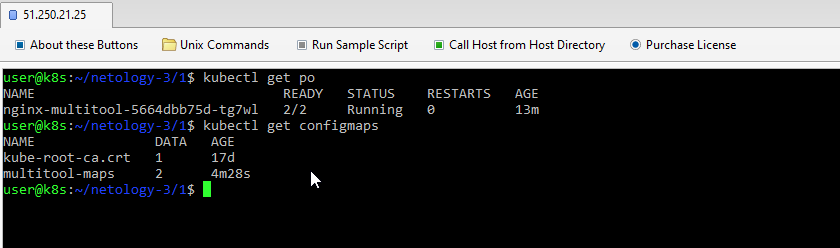 \
      > По итогу всё поднялось... тайм ту чекинг
  3. Продемонстрировать, что pod стартовал и оба конейнера работают.
      > 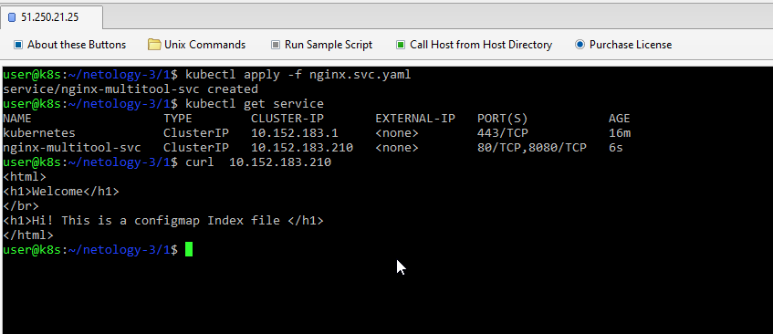 \
  4. Сделать простую веб-страницу и подключить её к Nginx с помощью ConfigMap. Подключить Service и показать вывод curl или в браузере.
      > Секция тоже сразу была настроена \
      > [Манифест конфигмаппа](src/nginx.configmap.yaml) \
      > 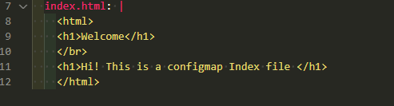 \
      > 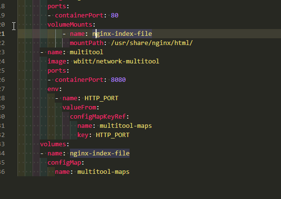
  5. Предоставить манифесты, а также скриншоты или вывод необходимых команд.
      > Собственно всё сразу сделал \
      >  \

------

### Задание 2. Создать приложение с вашей веб-страницей, доступной по HTTPS 

  
Детали

  1. Создать Deployment приложения, состоящего из Nginx.
      > [Манифест деплоймента](src/nginx-app.deployment.yaml)
  2. Создать собственную веб-страницу и подключить её как ConfigMap к приложению.
      > [Манифест конфигмэппа](src/nginx-app.configmap.yaml)
  3. Выпустить самоподписной сертификат SSL. Создать Secret для использования сертификата.
      > 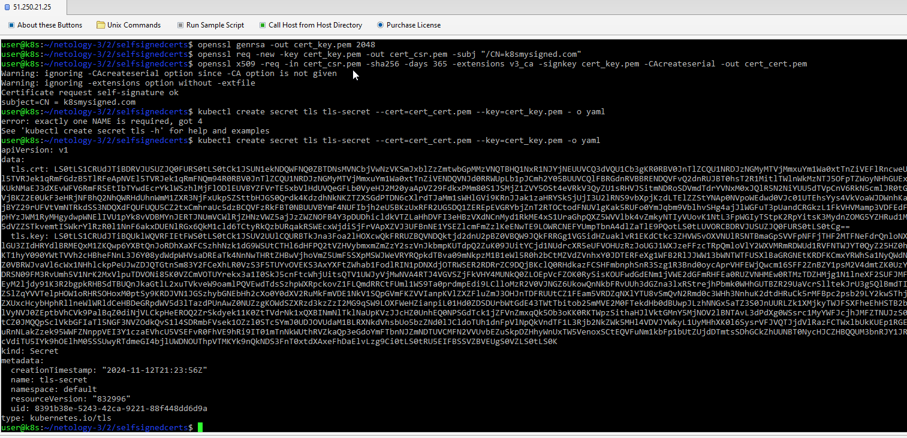 \
      > [Манифест секретов](src/nginx-app.secrets.yaml) \
      > 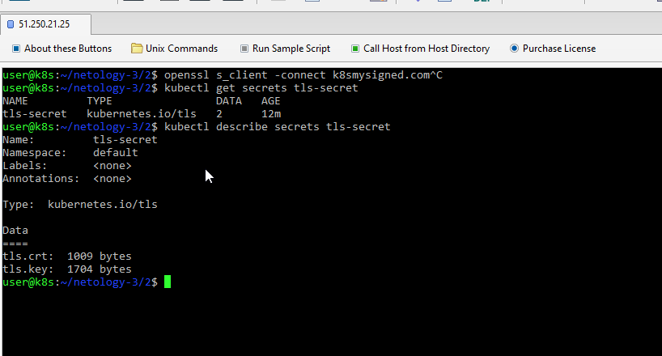
  4. Создать Ingress и необходимый Service, подключить к нему SSL в вид. Продемонстировать доступ к приложению по HTTPS. 
      > [Манифест ингресса](src/nginx-app.ingress.yaml) \
      > [Манифест сервиса](src/nginx-app.svc.yaml) \
      > 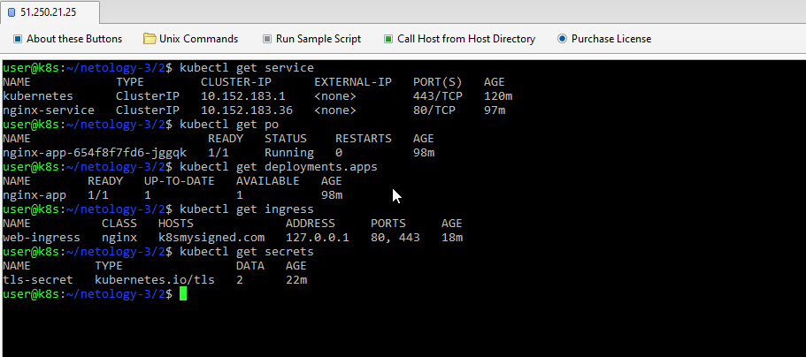 \
      > запустил всё
      > 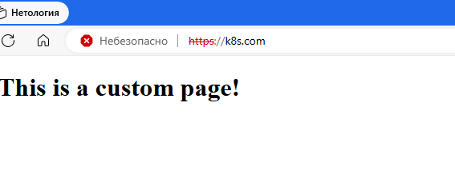
  5. Предоставить манифесты, а также скриншоты или вывод необходимых команд.
      > проверяю выданные серты. домен конечно выдуманный и прописанный в etc конфигах на нужный урл. 
      > 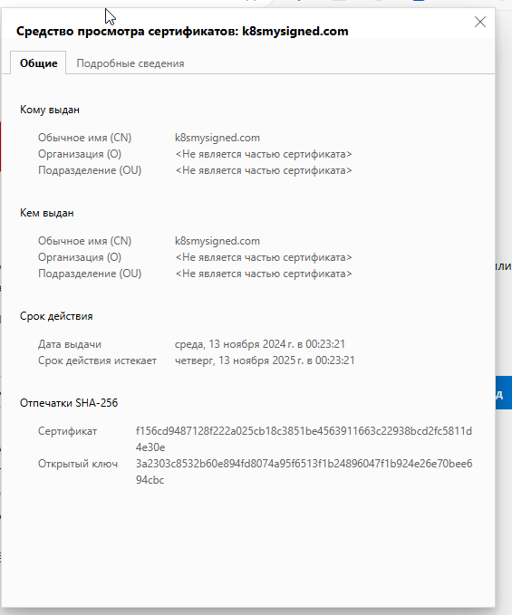 \
      > 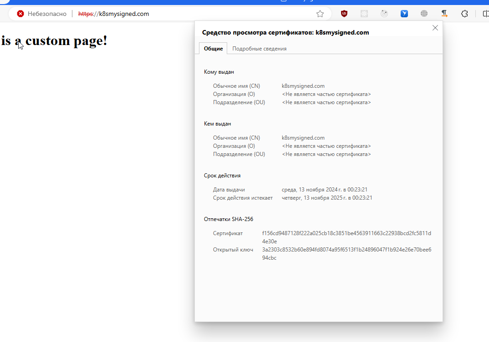 \
      > 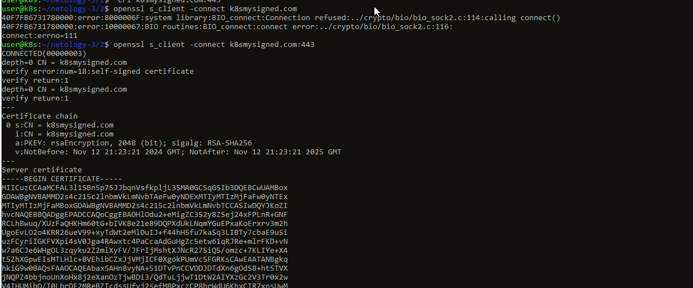

------
