# Kubernetes. Никулин Александр.
# Домашнее задание к занятию «Управление доступом»

### Цель задания

В тестовой среде Kubernetes нужно предоставить ограниченный доступ пользователю.

------

### Чеклист готовности к домашнему заданию
<details>
  <summary>Детали</summary>

  1. Установлено k8s-решение, например MicroK8S.
  2. Установленный локальный kubectl.
  3. Редактор YAML-файлов с подключённым github-репозиторием.
</details>

------

### Инструменты / дополнительные материалы, которые пригодятся для выполнения задания
<details>
  <summary>Детали</summary>

  1. [Описание](https://kubernetes.io/docs/reference/access-authn-authz/rbac/) RBAC.
  2. [Пользователи и авторизация RBAC в Kubernetes](https://habr.com/ru/company/flant/blog/470503/).
  3. [RBAC with Kubernetes in Minikube](https://medium.com/@HoussemDellai/rbac-with-kubernetes-in-minikube-4deed658ea7b).
</details>

------

### Задание 1. Создайте конфигурацию для подключения пользователя
<details>
  <summary>Детали</summary>

  1. Создайте и подпишите SSL-сертификат для подключения к кластеру.
      > Создадим ключ используя OPENSSL, после чего создаим CSR, и сгенерируем серт для пользователя используя серты microk8s \
      > 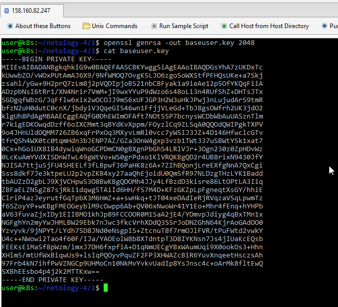 \
      > 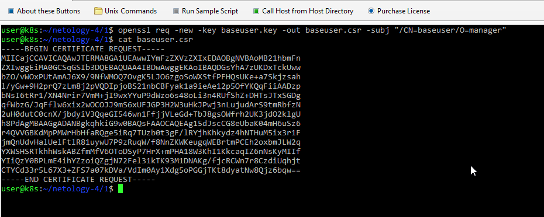 \
      > В microk8s серты кубера находятся в ```/var/snap/microk8s/current/certs/``` \
      > 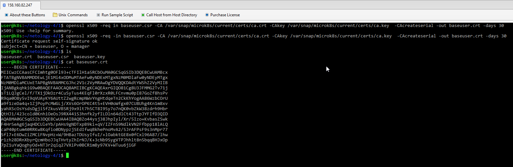
  2. Настройте конфигурационный файл kubectl для подключения.
      > Подготовим пользователя **baseuser** (да, ничего умнее в голову не пришло, но дял тестов хватит), привяжем к нему сгенерированные ключи \
      > 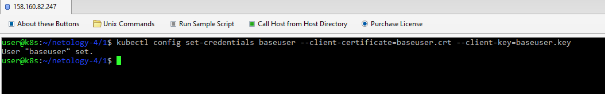 \
      > Подгтовим новый контекст и подключим его к пользователю
      > 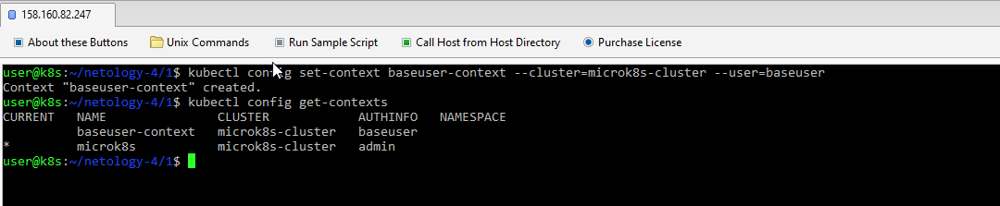 \
      > А так же включим RBAC \
      > 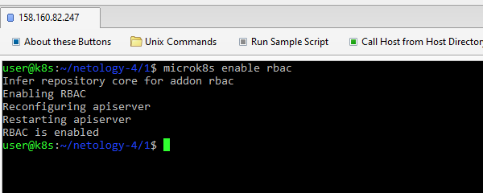
  3. Создайте роли и все необходимые настройки для пользователя.
      > Далее подготовим манифесты роли и связки \
      > [Role](src/baseuser.role.yaml) \
      > [RoleBinding](src/baseuser.rolebinding.yaml) \
      > 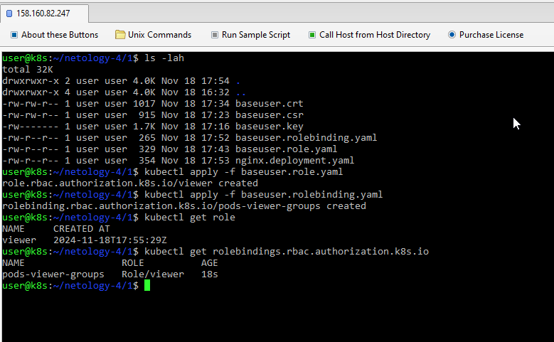
  4. Предусмотрите права пользователя. Пользователь может просматривать логи подов и их конфигурацию (`kubectl logs pod <pod_id>`, `kubectl describe pod <pod_id>`).
      > Ну а теперь начинаем применять всё что понаделали. Для этого осздаим [Деплоймент](src/nginx.deployment.yaml) и задеплоим его под пользователем. \
      > 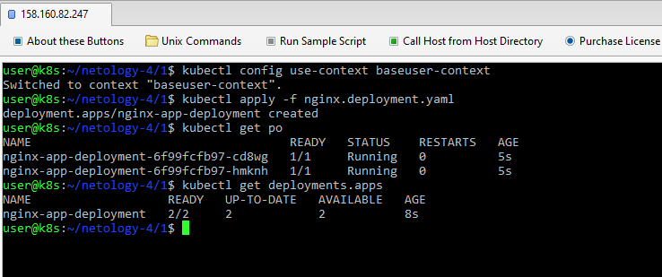 \
      > Тут я понял, что скорее всего надо было создать неймспейс для корректной проверки, или другой контекст под другим пользователем. Ну ничего, тогда сделаем следующше: переключимся на контекст админа, создадим неймспейс production и задеплоим там продовую версию [нгинкса](src/nginx.production.deployment.yaml). И попытаемся получить доступ от нашего базового пользователя к продовой версии. \
      > 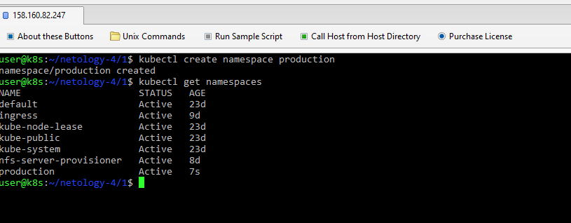 \
      > 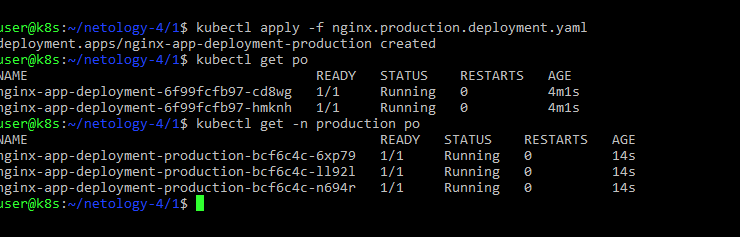 \
      > 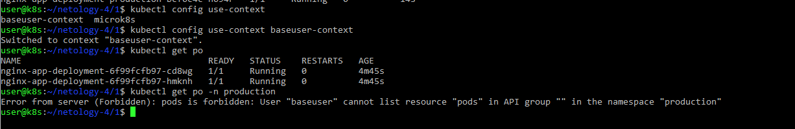 \
      > Уже лучше, не могу получить доступ к неймспейсу **production**. При этом kubectl под контекстом базового пользователя не предлагал прод неймспейс. Пришлось вбивать руками и результат выше. \
      > Пойдем дальше, попробуем получтиь логи своих подов и подов из неймпейса **production** \
      > 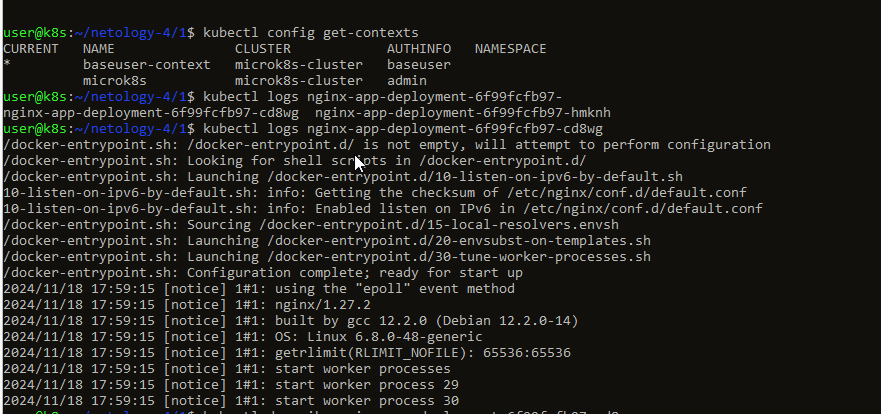 \
      > 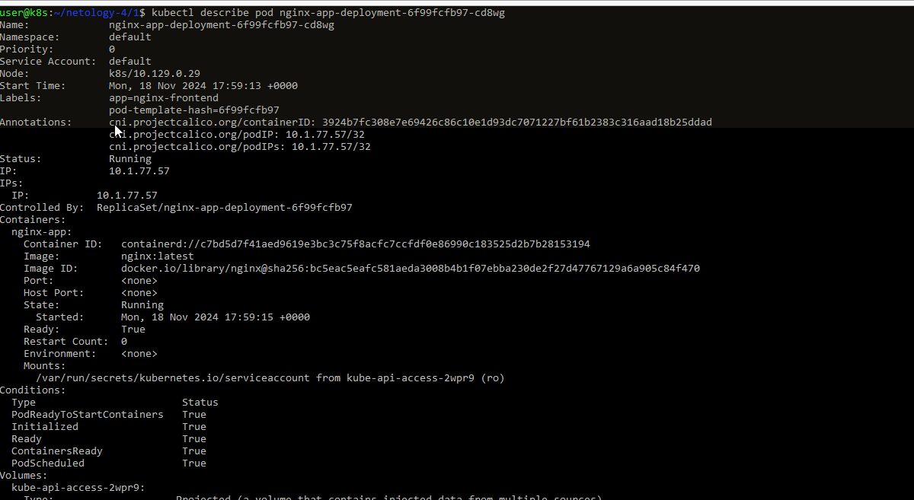 \
      > А теперь из неймпейса **production** \
      > 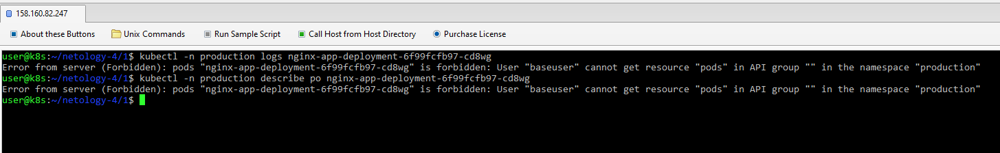
  5. Предоставьте манифесты и скриншоты и/или вывод необходимых команд.
      > [Role](src/baseuser.role.yaml) \
      > [RoleBinding](src/baseuser.rolebinding.yaml) \
      > [Deployment](src/nginx.deployment.yaml) \
      > [Deployment](src/nginx.production.deployment.yaml) \
      > Ход выполнения задания представлен выше
</details>

------

