# Kubernetes. Никулин Александр.
# Домашнее задание к занятию «Helm»

### Цель задания

В тестовой среде Kubernetes необходимо установить и обновить приложения с помощью Helm.

------

### Чеклист готовности к домашнему заданию

  
Детали

  1. Установленное k8s-решение, например, MicroK8S.
  2. Установленный локальный kubectl.
  3. Установленный локальный Helm.
  4. Редактор YAML-файлов с подключенным репозиторием GitHub.

------

### Инструменты и дополнительные материалы, которые пригодятся для выполнения задания

  
Детали

  1. [Инструкция](https://helm.sh/docs/intro/install/) по установке Helm. [Helm completion](https://helm.sh/docs/helm/helm_completion/).

------

### Задание 1. Подготовить Helm-чарт для приложения

  
Детали

  1. Необходимо упаковать приложение в чарт для деплоя в разные окружения. 
  2. Каждый компонент приложения деплоится отдельным deployment’ом или statefulset’ом.
  3. В переменных чарта измените образ приложения для изменения версии.

  > СОздал новый хельмчарт \
  > 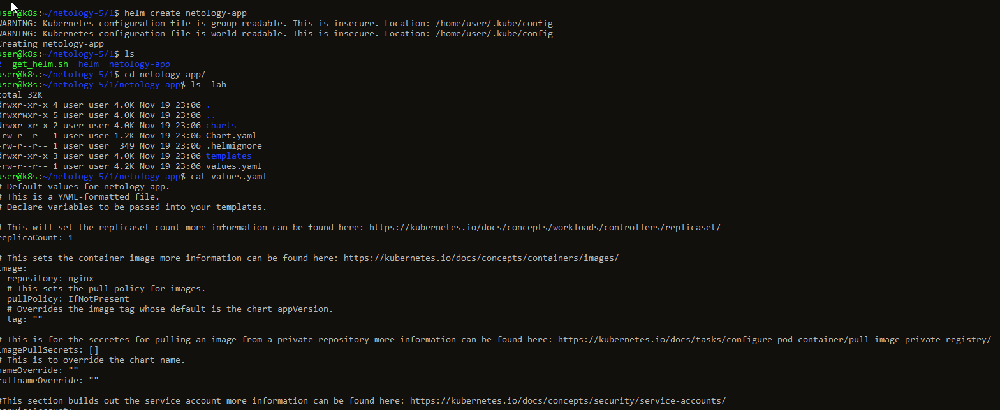 \
  > Далее создал два values где в деве установил latest тег, а в test указал версию 1.26.2 \
  > [develop](netology-app/values.develop.yaml) \
  > [test](netology-app/values.test.yaml)

------

### Задание 2. Запустить две версии в разных неймспейсах

  
Детали

  1. Подготовив чарт, необходимо его проверить. Запуститe несколько копий приложения.
  2. Одну версию в namespace=app1, вторую версию в том же неймспейсе, третью версию в namespace=app2.
  3. Продемонстрируйте результат.

  > Создал неймспейсы \
  > 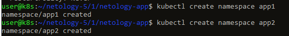 \
  > 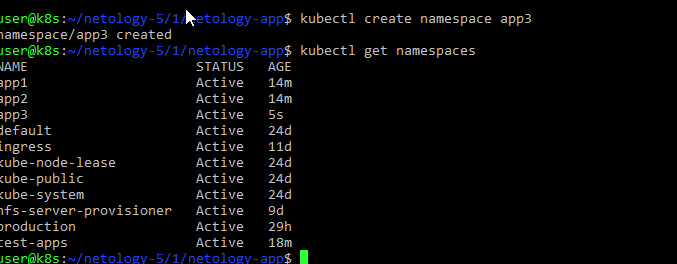 \
  > ПОднимаем приложение в неймспейсах \
  > 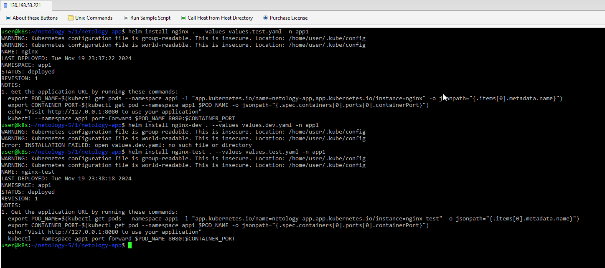 \
  > 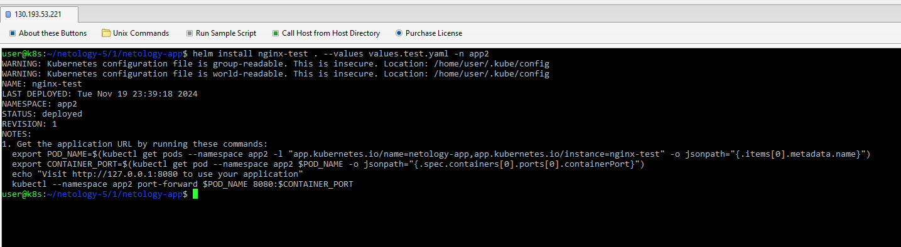 \
  > 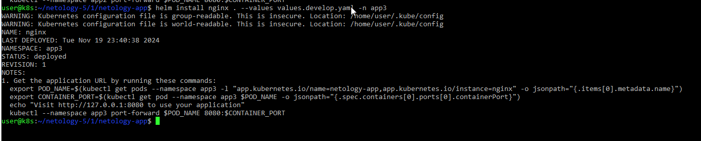 \
  > проверяем \
  > 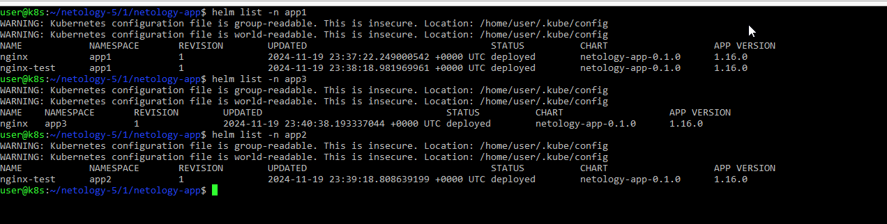 \
  > 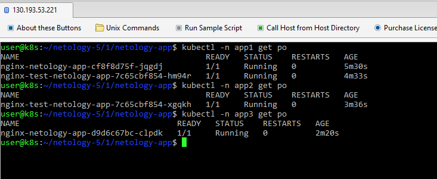 \
  > 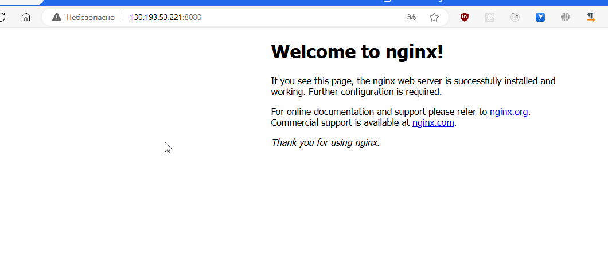 \
  > 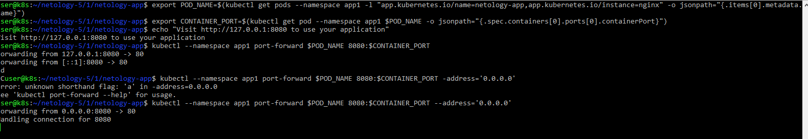 \
  > 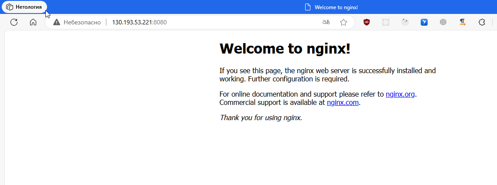 \
  > 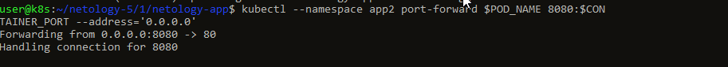 \

------