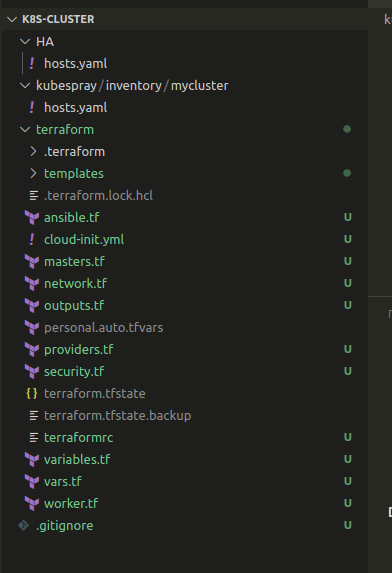
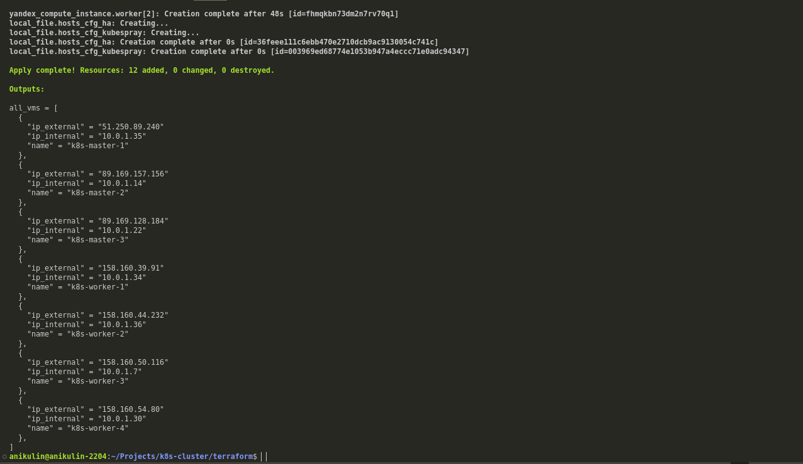
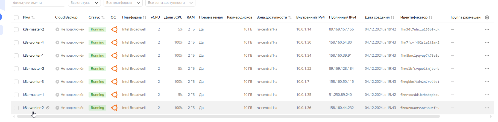
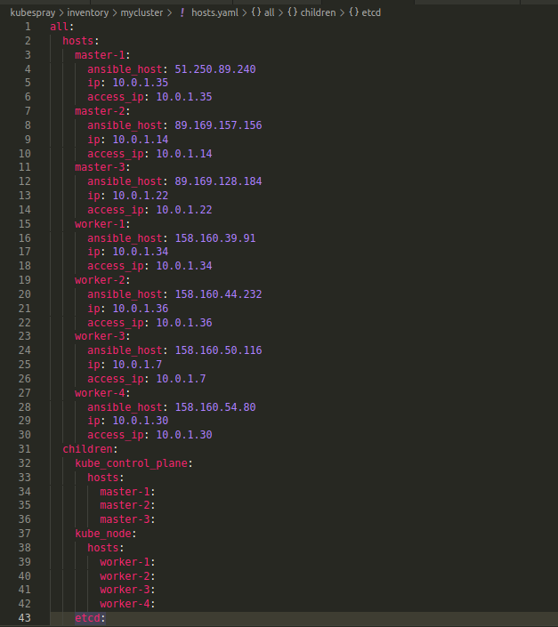
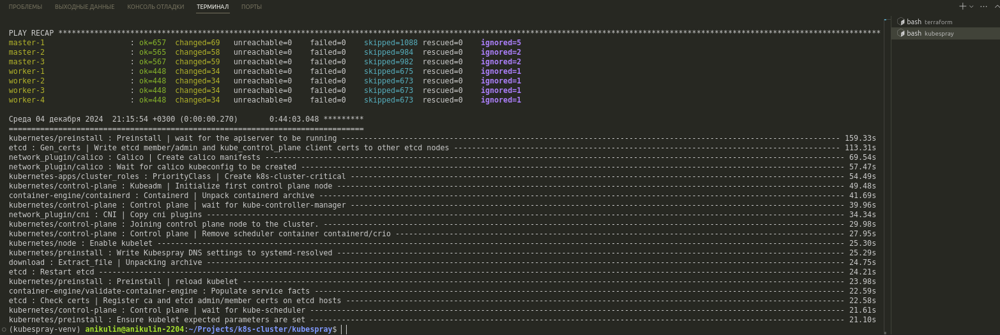
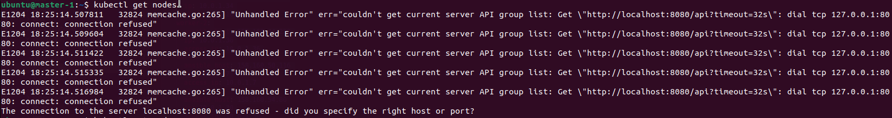
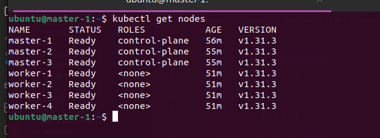

# Kubernetes. Никулин Александр.
# Домашнее задание к занятию «Установка Kubernetes»

### Цель задания

Установить кластер K8s.

### Чеклист готовности к домашнему заданию

1. Развёрнутые ВМ с ОС Ubuntu 20.04-lts.


### Инструменты и дополнительные материалы, которые пригодятся для выполнения задания
<details>
  <summary>Детали</summary>

  1. [Инструкция по установке kubeadm](https://kubernetes.io/docs/setup/production-environment/tools/kubeadm/create-cluster-kubeadm/).
  2. [Документация kubespray](https://kubespray.io/).
</details>

-----

### Задание 1. Установить кластер k8s с 1 master node
<details>
  <summary>Детали</summary>

  1. Подготовка работы кластера из 5 нод: 1 мастер и 4 рабочие ноды.
  2. В качестве CRI — containerd.
  3. Запуск etcd производить на мастере.
  4. Способ установки выбрать самостоятельно.

  > Чутка сделал по другому. ВЫбрал 3 мастера и 4 воркер ноды. \
  > Далее подготовил [терраформ](src/terraform), где настроил выгрузку данного [hosts.yaml](src/kubespray/inventory/mucluster/hosts.yaml) с помощью [hosts.tftpl](src/terraform/templates/hosts.tftpl)\
  > Сам terraform максимально простой, разворачиваем сеть, настраиваем правила, создаем мастеры, воркеры и т.п. За основу взял образы ubuntu-2404. \
  > Запустил в общем terraform \
  >  \
  >  \
  >  \
  > На выходе получил нужный файл \
  >  \
  > Далее зашел на https://github.com/kubernetes-sigs/kubespray и закачал в папку [kubespray](src/kubespray) \
  > Следуя инструкции: https://kubespray.io/#/docs/ansible/ansible?id=installing-ansible начал подготовку kubespray \
  > Создал environment + установил всё что идет в requirements.txt: 
  > ```
  > VENVDIR=kubespray-venv
  > KUBESPRAYDIR=/home/anikulin/Projects/k8s-cluster/kubespray
  > python3 -m venv $VENVDIR
  > source $VENVDIR/bin/activate
  > cd $KUBESPRAYDIR
  > pip install -U -r requirements.txt
  > ``` 
  > Ну а после запускаем установку через энсибл \
  > ``` ansible-playbook -i inventory/mycluster/ cluster.yml -b -v -u ubuntu ``` \
  > В общем во время работы скрипта столкнулся с парочкой проблем, все они крылись в этом https://github.com/kubernetes-sigs/kubespray/issues/10101 \
  > В итоге пришлось access_ip менять на local_ip и по итогу кластер встал на место \
  >  \
  > Зашел на master для проверки и при поптке выполнить команду: ```kubectl get nodes``` ловил ошибки доступа к класстеру \
  >  \
  > Я так понял что всё бы ничего, но не был настроен конфиг kubectl или что-то в этом духе. Посерфил инет нашел такое: https://github.com/kubernetes-sigs/kubespray/issues/1615 . \
  > Выполнил: ```sudo cp /etc/kubernetes/admin.conf $HOME/ && sudo chown $(id -u):$(id -g) $HOME/admin.conf && export KUBECONFIG=$HOME/admin.conf``` \
  > Далее повторная попытка \
  >  \
  > всё заработало. 
</details>

## Дополнительные задания (со звёздочкой)

**Настоятельно рекомендуем выполнять все задания под звёздочкой.** Их выполнение поможет глубже разобраться в материале.   
Задания под звёздочкой необязательные к выполнению и не повлияют на получение зачёта по этому домашнему заданию. 

------

### Задание 2*. Установить HA кластер
<details>
  <summary>Детали</summary>

  1. Установить кластер в режиме HA.
  2. Использовать нечётное количество Master-node.
  3. Для cluster ip использовать keepalived или другой способ.

  > Решил не делать
</details>
