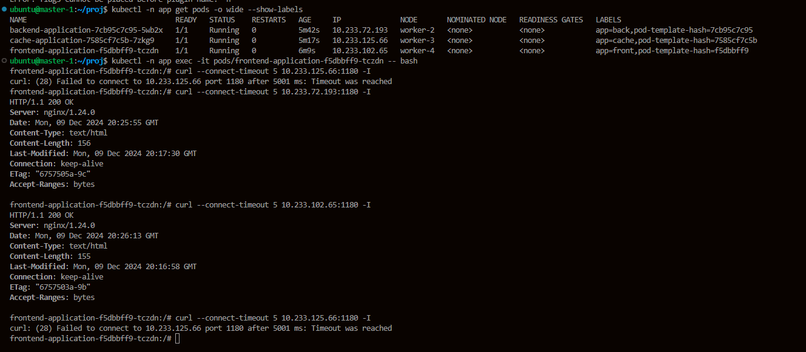

# Kubernetes. Никулин Александр.
# Домашнее задание к занятию «Как работает сеть в K8s»

### Цель задания

Настроить сетевую политику доступа к подам.

### Чеклист готовности к домашнему заданию

1. Кластер K8s с установленным сетевым плагином Calico.

### Инструменты и дополнительные материалы, которые пригодятся для выполнения задания

  
Детали

  1. [Документация Calico](https://www.tigera.io/project-calico/).
  2. [Network Policy](https://kubernetes.io/docs/concepts/services-networking/network-policies/).
  3. [About Network Policy](https://docs.projectcalico.org/about/about-network-policy).

-----

### Задание 1. Создать сетевую политику или несколько политик для обеспечения доступа

  
Детали

  
  1. Создать deployment'ы приложений frontend, backend и cache и соответсвующие сервисы.
  2. В качестве образа использовать network-multitool.
  3. Разместить поды в namespace App.
  4. Создать политики, чтобы обеспечить доступ frontend -> backend -> cache. Другие виды подключений должны быть запрещены.
  5. Продемонстрировать, что трафик разрешён и запрещён.

  > Повторение мать - учения. ИСпользуем предыдущий урок, что бы поднять класстер. \
  > С помощью терраформ поднимем инфру: [Исходники](../3.2/src/terraform) \
  >  \
  >  \
  > Далее с помощью Kubespray поднимем класстер. По дефолту там уже включен плагин Calico.
  >  \
  >  \
  > Кластер поднялся, но не весь... в общем через какое-то время подтянулась и последняя нода. Скорее всего ноды так долго поднимались из-за малой доли процессорного времени для нод (Что видно на фото) \
  >  \
  > првоерим наличие калико \
  > 
  > Далее подготовил все манифесты \
  > В манифестах deployment'ов в качестве образа используется network-multitool.
  > Для размещения подов в namespace app создам его: \
  > 
  > список манифестов: \
  >  \
  > Детальный: 
  > [frontend deployment](src/frontend.deployment.yaml) \
  > [frontend service](src/frontend.service.yaml)
  > [backend deployment](src/backend.deployment.yaml) \
  > [backend service](src/backend.service.yaml) \
  > [cache deployment](src/cache.deployment.yaml) \
  > [cache service](src/cache.service.yaml) \
  > [back-to-cache network](src/back-to-cache.network.yaml) \
  > [front-to-back policy](src/front-to-back.policy.yaml) \
  > [deny-all policy](src/deny-all.policy.yaml) \
  > Применяем конфигурации \
  >  \
  >  \
  > Всё поднялось, теперь зайдем в каждый и поделаем запросы \
  > Заходим во фронт и делаем запрсоы на соседние поды \
  >  \
  > Видно, что фронт может стучаться сам на себя, и на бек, но в кеш не может \
  > Заходим в бэк и делаем запрсоы на соседние поды \
  >  \
  > Видно, что бэк может стучаться сам на себя, и на кеш, но во фронт не может \
  > Заходим в кеш и делаем запрсоы на соседние поды \
  >  \
  > Видно, что кеш может стучаться только сам на себя, а на отсальные нет \

