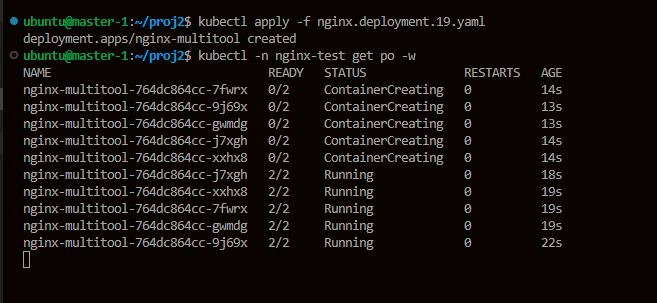

# Kubernetes. Никулин Александр.
# Домашнее задание к занятию «Обновление приложений»

### Цель задания

Выбрать и настроить стратегию обновления приложения.

### Чеклист готовности к домашнему заданию

1. Кластер K8s.

### Инструменты и дополнительные материалы, которые пригодятся для выполнения задания

  
Детали

1. [Документация Updating a Deployment](https://kubernetes.io/docs/concepts/workloads/controllers/deployment/#updating-a-deployment).
2. [Статья про стратегии обновлений](https://habr.com/ru/companies/flant/articles/471620/).

-----

### Задание 1. Выбрать стратегию обновления приложения и описать ваш выбор

  
Детали

  1. Имеется приложение, состоящее из нескольких реплик, которое требуется обновить.
  2. Ресурсы, выделенные для приложения, ограничены, и нет возможности их увеличить.
  3. Запас по ресурсам в менее загруженный момент времени составляет 20%.
  4. Обновление мажорное, новые версии приложения не умеют работать со старыми.
  5. Вам нужно объяснить свой выбор стратегии обновления приложения.

  > Для описанных условий я рекомендую использовать стратегию Rolling Update. Эта стратегия обновления не требует значительных ресурсов и является стандартной. Поскольку ресурсы ограничены, важно использовать следующие параметры: \
  > \
  > **maxSurge: 20%** - Этот параметр позволяет запустить до 20% новых реплик приложения параллельно с текущими. Например, если у вас есть 5 реплик, то с этим параметром можно запустить еще одну реплику с новой версией приложения. \
  > **maxUnavailable: 20%** - Данный параметр позволяет временно выключить до 20% старых реплик приложения во время обновления. Например, если у вас есть 5 реплик, то во время обновления будет выключена одна реплика, чтобы дать ресурсы новой реплике. \
  > \
  > Однако, если обновление является мажорным и новые версии приложения не совместимы со старыми, можно установить параметр maxUnavailable: 100%. Это позволит не удалять старые реплики до тех пор, пока новые не будут проверены. Старые реплики будут использовать ресурсы, но если к ним не будет обращений, это не приведет к значительному потреблению ресурсов. После проверки новых реплик старые можно будет удалить. \
  > \
  > Также стоит учитывать, что обновления лучше проводить в периоды, когда кластер Kubernetes наименее загружен. \
  > \
  > Если ресурсов совсем нет, можно использовать стратегию обновления Recreate. Это приведет к остановке текущих подов и прекращению всех запросов к ним. После остановки старых подов будут созданы новые поды, а старые будут полностью удалены.

### Задание 2. Обновить приложение

  
Детали

  1. Создать deployment приложения с контейнерами nginx и multitool. Версию nginx взять 1.19. Количество реплик — 5.
  2. Обновить версию nginx в приложении до версии 1.20, сократив время обновления до минимума. Приложение должно быть доступно.
  3. Попытаться обновить nginx до версии 1.28, приложение должно оставаться доступным.
  4. Откатиться после неудачного обновления.

  > Подготовил класстер + создал namespace nginx-test \
  >  \
  > Подготовил сразу три деплоя с разными версиями \
  > [nginx 1.19](src/nginx.deployment.19.yaml) \
  > [nginx 1.20](src/nginx.deployment.20.yaml) \
  > [nginx 1.28](src/nginx.deployment.28.yaml) \
  > Деплоим 1.19 версию \
  >  \
  > Пояивились 5 реплик, проверим версию
  >  \
  > Всё на месте, теперь будем деплоить 1.20 \
  > В манифесте deployment обновляю версию nginx до 1.20, а также вношу изменения в аннотацию для более ясного понимания происходящих процессов. \
  > Стратегию обновления выбираю RollingUpdate, при этом устанавливаю значение 2 для параметра maxSurge и значение 3 для параметра maxUnavailable. Это позволит сохранить работоспособность двух реплик приложения со старой версией даже в случае возникновения проблем с обновлением, обеспечивая тем самым доступность приложения. \
  > После запуска трёх реплик с новой версией nginx, две реплики со старой версией будут отключены, и вместо них будут созданы три реплики с новой версией nginx. После запуска трёх реплик с новой версией приложения, две реплики со старой версией будут уничтожены, и вместо них будут запущены две реплики с новой версией приложения. \
  > Увидим следующую картинку
  >  \
  > Проверим текущую версию и какие поды запущены, а так же как это происходило \
  >  \
  > првоерим историю \
  >  \
  > Обновляемся до версии 1.28 и видим ошибки \
  >  \
  >  \
  > Видим что 2 старых пода запущены, по остальным ошибка.  \
  > Посмотрим что по истории и откатимся  \
  >  \
  >  \
  > По скольку был откат, то 2я ревизия перехала на 4 позицию

## Дополнительные задания — со звёздочкой*

Задания дополнительные, необязательные к выполнению, они не повлияют на получение зачёта по домашнему заданию. **Но мы настоятельно рекомендуем вам выполнять все задания со звёздочкой.** Это поможет лучше разобраться в материале.   

### Задание 3*. Создать Canary deployment

1. Создать два deployment'а приложения nginx.
2. При помощи разных ConfigMap сделать две версии приложения — веб-страницы.
3. С помощью ingress создать канареечный деплоймент, чтобы можно было часть трафика перебросить на разные версии приложения.

  
Детали

  > Решил не делать

