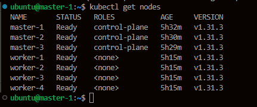
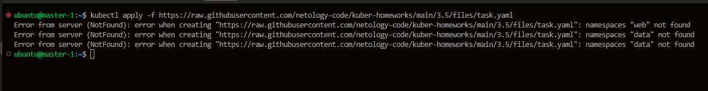
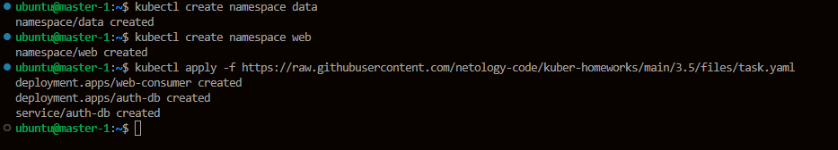
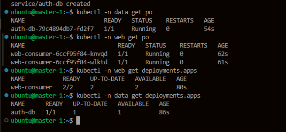
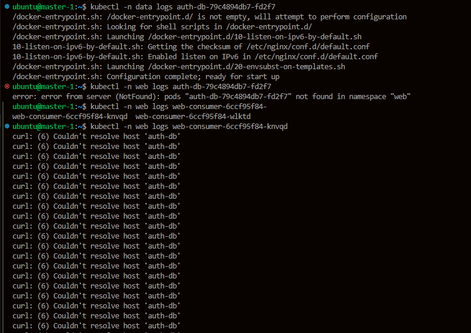
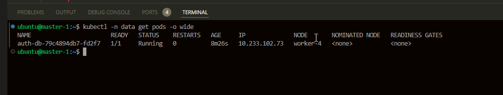
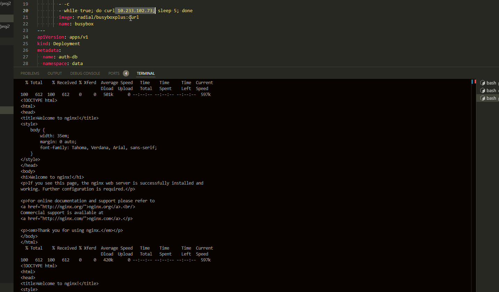
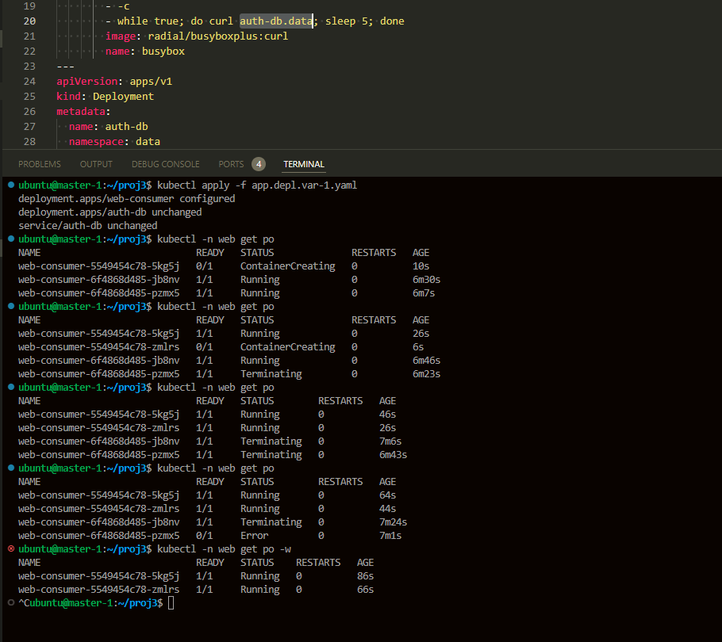
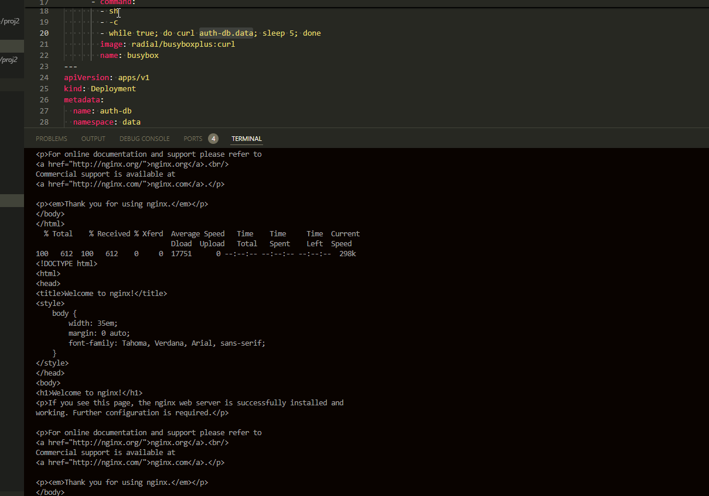

# Kubernetes. Никулин Александр.
# Домашнее задание к занятию Troubleshooting

### Цель задания

Устранить неисправности при деплое приложения.

### Чеклист готовности к домашнему заданию

1. Кластер K8s.
<details>
  <summart>Details</summart>

  
</details>
### Задание. При деплое приложение web-consumer не может подключиться к auth-db. Необходимо это исправить

1. Установить приложение по команде:
<details>
  <summary>Детали</summary>

  ```shell
  kubectl apply -f https://raw.githubusercontent.com/netology-code/kuber-homeworks/main/3.5/files/task.yaml
  ```
  2. Выявить проблему и описать.
  3. Исправить проблему, описать, что сделано.
  4. Продемонстрировать, что проблема решена.

  > Установил и вижу сразу проблемы \
  >  \
  > Исправляем \
  >  \ 
  >  \
  > Проверим логи \
  >  \
  > Видно что с приложением auth-db ok, а вот с web есть проблемы, не может достучаться до имени хоста \
  > Вариант первый. \
  > В манифесте указано доменное имя, но можно указать и ip \
  >  \
  >  \
  > Но вариант так себе, ибо после рестарта, ip изменится \
  > Есть ещё пару вариантов. \
  > Разместить их в одном namespace либо указать в манифесте более полную ссылку auth-db.data \
  > Предположу что сервисы не с проста были размещены в разных неймспейсах, поэтому укажем auth-db.data \
  >  \
  >  \
  > Работает
</details>
