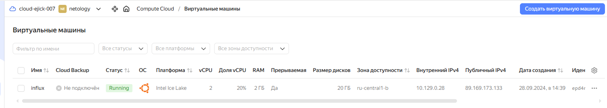
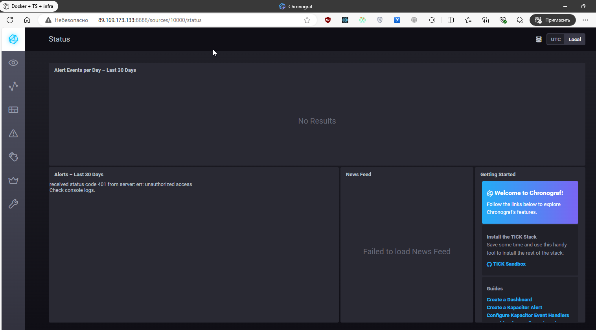
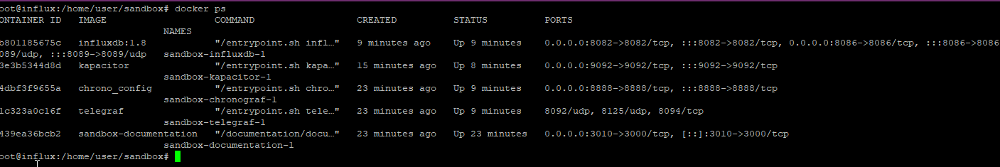
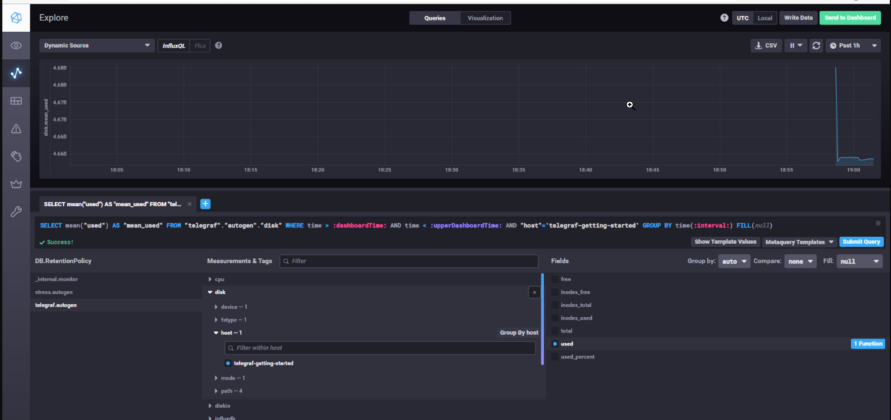
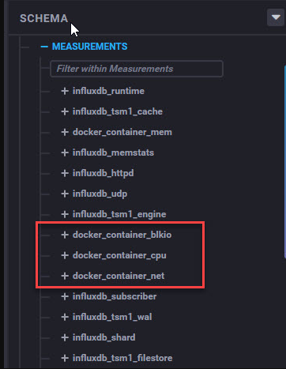
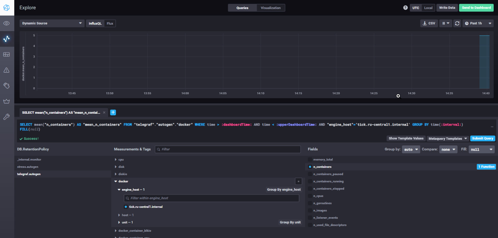
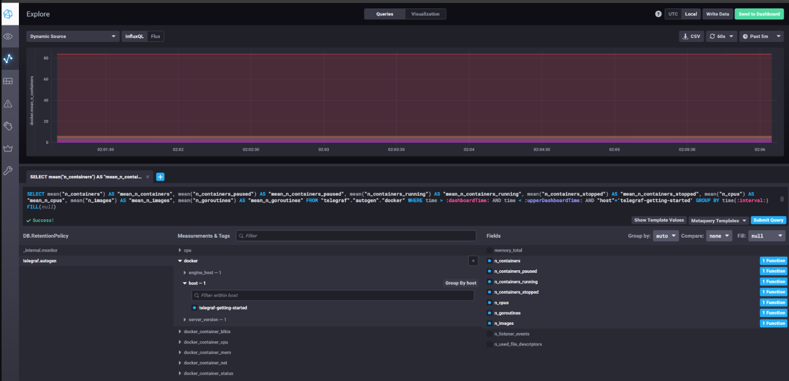

# Мониторинг и логи. Никулин Александр. 
# Домашнее задание к занятию "13.Системы мониторинга"

## Обязательные задания

<details>
  <summary>Детали</summary>

  1. Вас пригласили настроить мониторинг на проект. На онбординге вам рассказали, что проект представляет из себя 
платформу для вычислений с выдачей текстовых отчетов, которые сохраняются на диск. Взаимодействие с платформой 
осуществляется по протоколу http. Также вам отметили, что вычисления загружают ЦПУ. Какой минимальный набор метрик вы
выведите в мониторинг и почему?

  <details>
    <summary>Решение</summary>
    
    выжимка систем: 
    - nginx (http взаимодействие)
    - железо (вычислительные способности + место)
    - работа самого сервиса

    метрик можно накрутить множество, в прцоессе рабоыт с системой формируются новые требования, но минимум наверное такой:

    метрики для сетки: 
    - Мониторинг общего количества (http/https) запросов к данному приложению (Проверяем нагрузку)
    - Возможно количество по кнкретным урлам (проверяем нагрузку на метрики)
    - Количество неудачных ответов пользователям (ошибки 400/404) (соотношение ошибок к успеху)

    метрики для железа
    - CPU
      - Общая загрузка ЦПУ
      - Часть нагрузки ЦПУ оказываемой непосредственно приложением, или каким либо важным рабочим процессом данного приложения
    - RAM
      - Количество занятой и оставшейся памяти
    - HDD
      - Нагрузка на диск
      - Остаточная ёмкость
      - Состояние диска (smart)
      - График заполняемости свободного места на диске
      - контроль inodes
    - LAN
      - Количество проходящего трафика

    метрики для самого сервиса
    - Количество успешно выданных отчетов
    - Количество неудачных отчетов
    - Количество отчетов в работе
    - Мониторинг среднего времени формирования отчетов

    можно было предусмотреть метрики ещё по ИБ (хотя по условиям нет)
    - количество неуспещных попыток авторизаций
    - првоерка сертов
    - спамовые формирования отчетов

  </details>

  #
  2. Менеджер продукта посмотрев на ваши метрики сказал, что ему непонятно что такое RAM/inodes/CPUla. Также он сказал, 
  что хочет понимать, насколько мы выполняем свои обязанности перед клиентами и какое качество обслуживания. Что вы 
  можете ему предложить?

  <details>
    <summary>Решение</summary>

    Делаем для менеджера нормальный вбе интерфейс, куда прописываем описание/подсказки для параметров: 
    - RAM - счетчики памяти сколько свободно физической, сколько занято физической, и сколько виртуальной памяти. 
    - inodes - количество свободных дескрипторов для файлов, если оно закончится, то, нельзя будет создать новый файл.
    - CPUla - CPU load -  средняя нагрузка на процессор системы.

    Далее SLA (соглашение об уровне обслуживания) в рамках которого будут указаны SLO (целевой уровень качества обслуживания) для необходимых метрик. После чего менеджерам будет проще ориентироваться в состоянии продукта, так как их будут интересовать только разницы значений SLO и SLI (индикатор качества обслуживания). Если значения SLI необходимых метрики не противоречат установленным для неё SLO тогда проект в нормально состояние. 
  </details>

  #
  3. Вашей DevOps команде в этом году не выделили финансирование на построение системы сбора логов. Разработчики в свою 
  очередь хотят видеть все ошибки, которые выдают их приложения. Какое решение вы можете предпринять в этой ситуации, 
  чтобы разработчики получали ошибки приложения?

  <details>
    <summary>Решение</summary>

    Использование opensource или бесплатных интсрументов для сборка и анализа логов. 
    К примеру: 
    - ELK 
    - Grafana
    - Sentry
  </details>

  #
  4. Вы, как опытный SRE, сделали мониторинг, куда вывели отображения выполнения SLA=99% по http кодам ответов. 
  Вычисляете этот параметр по следующей формуле: summ_2xx_requests/summ_all_requests. Данный параметр не поднимается выше 
  70%, но при этом в вашей системе нет кодов ответа 5xx и 4xx. Где у вас ошибка?

  <details>
    <summary>Решение</summary>

    В формуле из задания не используются значения кодов 1xx и 3xx
  </details>

  #
  5. Опишите основные плюсы и минусы pull и push систем мониторинга.

  <details>
    <summary>Решение</summary>

    # Pull

    Плюсы:
    - Сниженная нагрузка на целевые системы: В pull-системах мониторинга, мониторинговые агенты (клиенты) опрашивают целевые системы (серверы) по запросу, что позволяет более точно контролировать частоту опроса и снижает нагрузку на целевые системы. Это особенно полезно для высоконагруженных приложений.
    - Более простая настройка и установка: Pull-системы часто проще настраивать и устанавливать, так как агенты мониторинга могут быть легко развернуты на целевых серверах без дополнительных настроек на стороне сервера.
    - Прозрачность для целевых систем: Целевые системы могут быть неосведомленными о наличии мониторинга и агентов, что может быть полезно в некоторых ситуациях для соблюдения конфиденциальности.

    Минусы: 
    - Задержка в обновлении данных: Поскольку мониторинговые агенты опрашивают целевые системы по расписанию, существует задержка в обновлении данных. 
    - Потеря данных: Если агент неспособен опросить целевую систему (например, из-за сетевой проблемы или сбоя агента), это может привести к потере данных мониторинга.

    # Push
    Плюсы:
    - Реальное время: Push-системы мониторинга позволяют отправлять данные в реальном времени, что делает их более подходящими для мониторинга важных событий и реагирования на них мгновенно.
    - Легкость настройки центрального сервера: В push-системах, центральный сервер (коллектор данных) более централизован и может быть легче настроен для обработки данных от множества клиентских систем.
    - Уведомления в режиме реального времени: Push-системы могут легко отправлять уведомления и события в реальном времени на основе данных мониторинга.

    Минусы:

    - Высокая нагрузка на целевые системы: При использовании push-систем могут возникнуть проблемы с нагрузкой на целевые системы, особенно если большое количество данных отправляется в реальном времени.
    - Сложность настройки агентов: Настройка и установка агентов на целевых серверах может быть более сложной и требовательной к ресурсам процедурой.
    - Безопасность и приватность: Push-системы требуют от целевых систем предоставлять доступ для приема данных мониторинга, что может повысить риски вопросов безопасности и приватности.
  </details>

  #
  6. Какие из ниже перечисленных систем относятся к push модели, а какие к pull? А может есть гибридные?
      - Prometheus 
      - TICK
      - Zabbix
      - VictoriaMetrics
      - Nagios
  #

  <details>
    <summary>Решение</summary>

    - Prometheus - Pull
    - TICK - Push
    - Zabbix - Гибридная
    - VictoriaMetrics - Pull
    - Nagios - Push
  </details>

  7. Склонируйте себе [репозиторий](https://github.com/influxdata/sandbox/tree/master) и запустите TICK-стэк, 
  используя технологии docker и docker-compose.

  В виде решения на это упражнение приведите скриншот веб-интерфейса ПО chronograf (`http://localhost:8888`). 

  P.S.: если при запуске некоторые контейнеры будут падать с ошибкой - проставьте им режим `Z`, например
  `./data:/var/lib:Z`

  <details>
    <summary>Решение</summary>

    - 
    - 
    - 
    - 
  </details>

  #
  8. Перейдите в веб-интерфейс Chronograf (http://localhost:8888) и откройте вкладку Data explorer.
          
      - Нажмите на кнопку Add a query
      - Изучите вывод интерфейса и выберите БД telegraf.autogen
      - В `measurments` выберите cpu->host->telegraf-getting-started, а в `fields` выберите usage_system. Внизу появится график утилизации cpu.
      - Вверху вы можете увидеть запрос, аналогичный SQL-синтаксису. Поэкспериментируйте с запросом, попробуйте изменить группировку и интервал наблюдений.

  Для выполнения задания приведите скриншот с отображением метрик утилизации cpu из веб-интерфейса.


  <details>
    <summary>Решение</summary>

    - 
    - 
  </details>

  #
  9. Изучите список [telegraf inputs](https://github.com/influxdata/telegraf/tree/master/plugins/inputs). 
  Добавьте в конфигурацию telegraf следующий плагин - [docker](https://github.com/influxdata/telegraf/tree/master/plugins/inputs/docker):
  ```
  [[inputs.docker]]
    endpoint = "unix:///var/run/docker.sock"
  ```

  Дополнительно вам может потребоваться донастройка контейнера telegraf в `docker-compose.yml` дополнительного volume и 
  режима privileged:
  ```
    telegraf:
      image: telegraf:1.4.0
      privileged: true
      volumes:
        - ./etc/telegraf.conf:/etc/telegraf/telegraf.conf:Z
        - /var/run/docker.sock:/var/run/docker.sock:Z
      links:
        - influxdb
      ports:
        - "8092:8092/udp"
        - "8094:8094"
        - "8125:8125/udp"
  ```

  После настройке перезапустите telegraf, обновите веб интерфейс и приведите скриншотом список `measurments` в 
  веб-интерфейсе базы telegraf.autogen . Там должны появиться метрики, связанные с docker.

  Факультативно можете изучить какие метрики собирает telegraf после выполнения данного задания.

  <details>
    <summary>Решение</summary>

    - 
  </details>
  #
</details>

## Дополнительное задание (со звездочкой*) - необязательно к выполнению
<details>
  <summary>Детали</summary>

  1. Вы устроились на работу в стартап. На данный момент у вас нет возможности развернуть полноценную систему 
  мониторинга, и вы решили самостоятельно написать простой python3-скрипт для сбора основных метрик сервера. Вы, как 
  опытный системный-администратор, знаете, что системная информация сервера лежит в директории `/proc`. 
  Также, вы знаете, что в системе Linux есть  планировщик задач cron, который может запускать задачи по расписанию.
  
  Суммировав все, вы спроектировали приложение, которое:
  - является python3 скриптом
  - собирает метрики из папки `/proc`
  - складывает метрики в файл 'YY-MM-DD-awesome-monitoring.log' в директорию /var/log 
  (YY - год, MM - месяц, DD - день)
  - каждый сбор метрик складывается в виде json-строки, в виде:
    + timestamp (временная метка, int, unixtimestamp)
    + metric_1 (метрика 1)
    + metric_2 (метрика 2)
    
       ...
       
    + metric_N (метрика N)
    
  - сбор метрик происходит каждую 1 минуту по cron-расписанию
  
  Для успешного выполнения задания нужно привести:
  
  а) работающий код python3-скрипта,
  
  б) конфигурацию cron-расписания,
  
  в) пример верно сформированного 'YY-MM-DD-awesome-monitoring.log', имеющий не менее 5 записей,
  
  P.S.: количество собираемых метрик должно быть не менее 4-х.
  P.P.S.: по желанию можно себя не ограничивать только сбором метрик из `/proc`.
  
  2. В веб-интерфейсе откройте вкладку `Dashboards`. Попробуйте создать свой dashboard с отображением:
  
      - утилизации ЦПУ
      - количества использованного RAM
      - утилизации пространства на дисках
      - количество поднятых контейнеров
      - аптайм
      - ...
      - фантазируйте)
      
      ---

  </details>
### Как оформить ДЗ?

Выполненное домашнее задание пришлите ссылкой на .md-файл в вашем репозитории.

---
