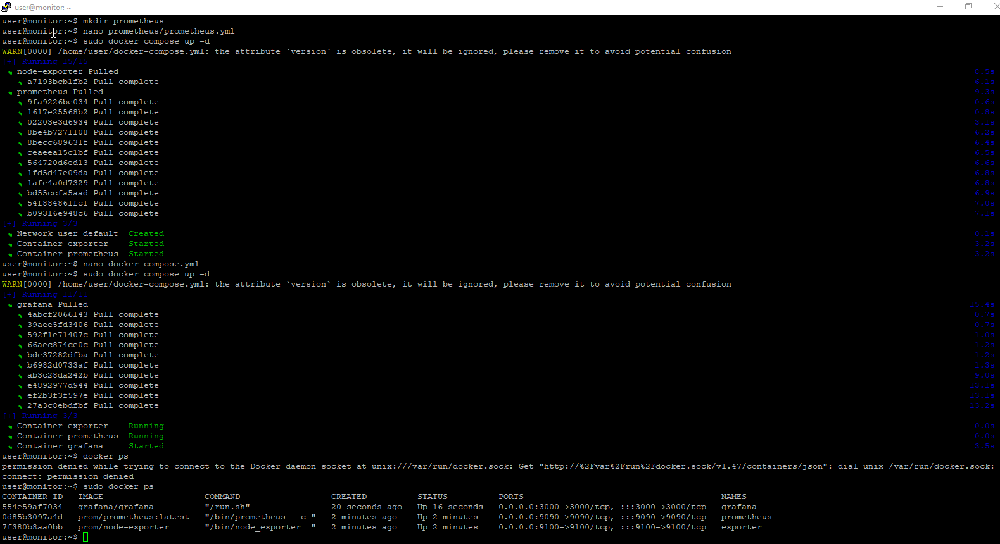
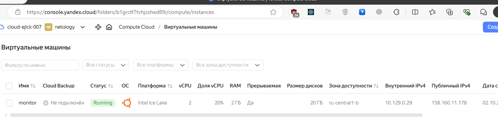
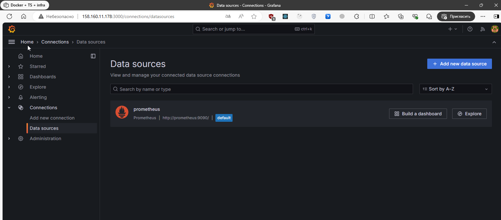
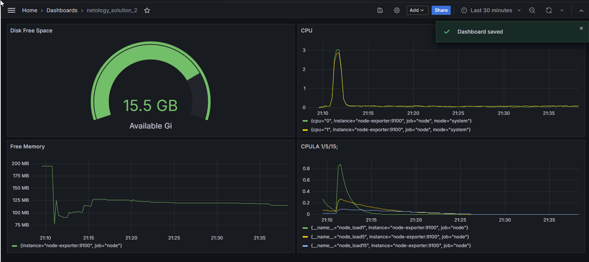
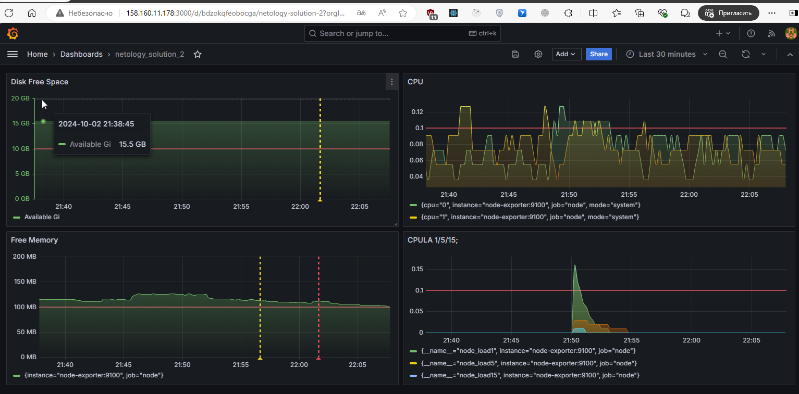
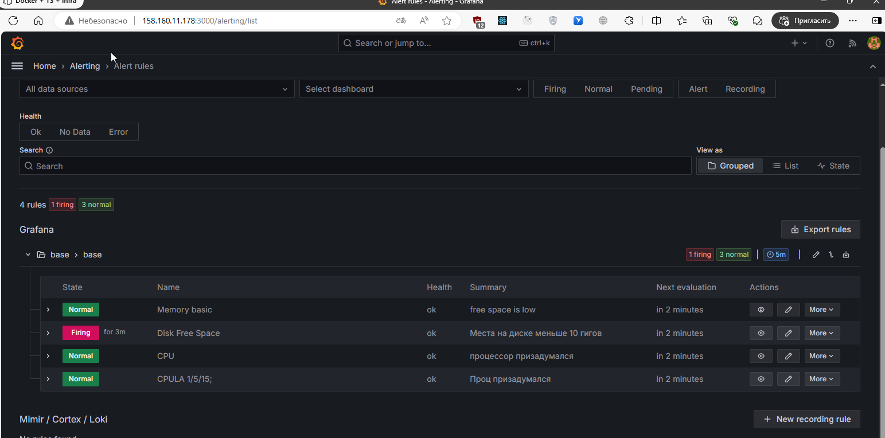

# Мониторинг и логи. Никулин Александр. 
# Домашнее задание к занятию 14 «Средство визуализации Grafana»

## Задание повышенной сложности

	
Детали

  **При решении задания 1** не используйте директорию [help](./help) для сборки проекта. Самостоятельно разверните grafana, где в роли источника данных будет выступать prometheus, а сборщиком данных будет node-exporter:

  - grafana;
  - prometheus-server;
  - prometheus node-exporter.

  За дополнительными материалами можете обратиться в официальную документацию grafana и prometheus.

  В решении к домашнему заданию также приведите все конфигурации, скрипты, манифесты, которые вы 
  использовали в процессе решения задания.

  > Обновленный конфиг. Базовый который шел в help не завелся, а точнее не было доступа к прому. Так что с официальной документации накотал и запустил. \
  > [Ссылка на свою реализацию](https://github.com/ADNikulin/netology/tree/master/monitoring-10/03-grafana/custom) \
  > 

  **При решении задания 3** вы должны самостоятельно завести удобный для вас канал нотификации, например, Telegram или email, и отправить туда тестовые события.

  В решении приведите скриншоты тестовых событий из каналов нотификаций.

## Обязательные задания

### Задание 1

	
Детали

  1. Используя директорию [help](./help) внутри этого домашнего задания, запустите связку prometheus-grafana.
  1. Зайдите в веб-интерфейс grafana, используя авторизационные данные, указанные в манифесте docker-compose.
  1. Подключите поднятый вами prometheus, как источник данных.
  1. Решение домашнего задания — скриншот веб-интерфейса grafana со списком подключенных Datasource.

  > /
  > 

## Задание 2

	
Детали

  Изучите самостоятельно ресурсы:

  1. [PromQL tutorial for beginners and humans](https://valyala.medium.com/promql-tutorial-for-beginners-9ab455142085).
  1. [Understanding Machine CPU usage](https://www.robustperception.io/understanding-machine-cpu-usage).
  1. [Introduction to PromQL, the Prometheus query language](https://grafana.com/blog/2020/02/04/introduction-to-promql-the-prometheus-query-language/).

  Создайте Dashboard и в ней создайте Panels:

  - утилизация CPU для nodeexporter (в процентах, 100-idle);
    > `100 * (rate(node_cpu_seconds_total{mode="system"}[1m]))`
  - CPULA 1/5/15;
    > `node_load1{job="node", instance="node-exporter:9100"}`
    > `node_load5{job="node", instance="node-exporter:9100"}`
    > `node_load15{job="node", instance="node-exporter:9100"}`
  - количество свободной оперативной памяти;
    > `node_memory_MemFree_bytes{job="node", instance="node-exporter:9100"} / 1024 / 1024`
  - количество места на файловой системе.
    > `node_filesystem_free_bytes{job="node", instance="node-exporter:9100"} / 1024 / 1024 / 1024`

  > На самом деле `job="node", instance="node-exporter:9100"` можно было вынести в переменные  которые можно подставлять и выбирать в загаловке дашборды, но не стал заморачиваться с этим, так как не является целью задания. В целом лично на мой взгляд, выносить точечные параметры нод и джобов прям в графики не имеет смысла, и для них надо создавать variables в дашборде. имхо 

  > \ 
  > [дашборда](grafana_dashboards/netology_load_2.json)

  Для решения этого задания приведите promql-запросы для выдачи этих метрик, а также скриншот получившейся Dashboard.

## Задание 3

	
Детали

  1. Создайте для каждой Dashboard подходящее правило alert — можно обратиться к первой лекции в блоке «Мониторинг».
  1. В качестве решения задания приведите скриншот вашей итоговой Dashboard.

  > \
  > 

## Задание 4

	
Детали

  1. Сохраните ваш Dashboard.Для этого перейдите в настройки Dashboard, выберите в боковом меню «JSON MODEL». Далее скопируйте отображаемое json-содержимое в отдельный файл и сохраните его.
  1. В качестве решения задания приведите листинг этого файла.

  - [Alerts](grafana_dashboards/alert_rules.yaml)
  - [дашбоард](grafana_dashboards/netology_load_2.json)

---

### Как оформить решение задания

Выполненное домашнее задание пришлите в виде ссылки на .md-файл в вашем репозитории.

---
